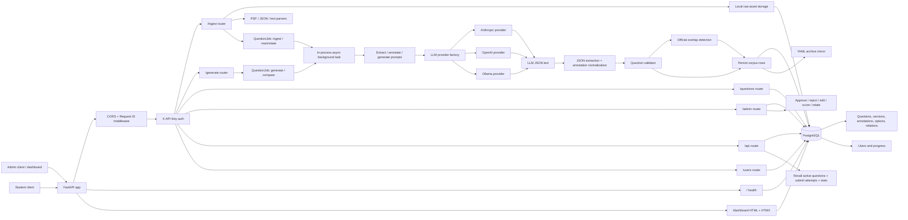
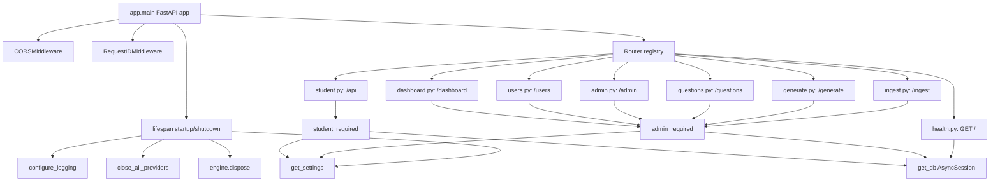
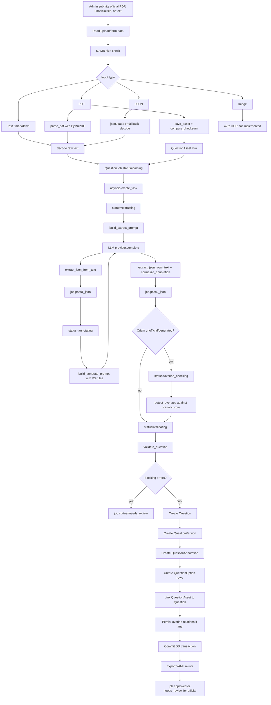
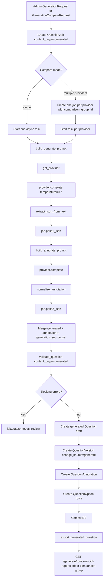
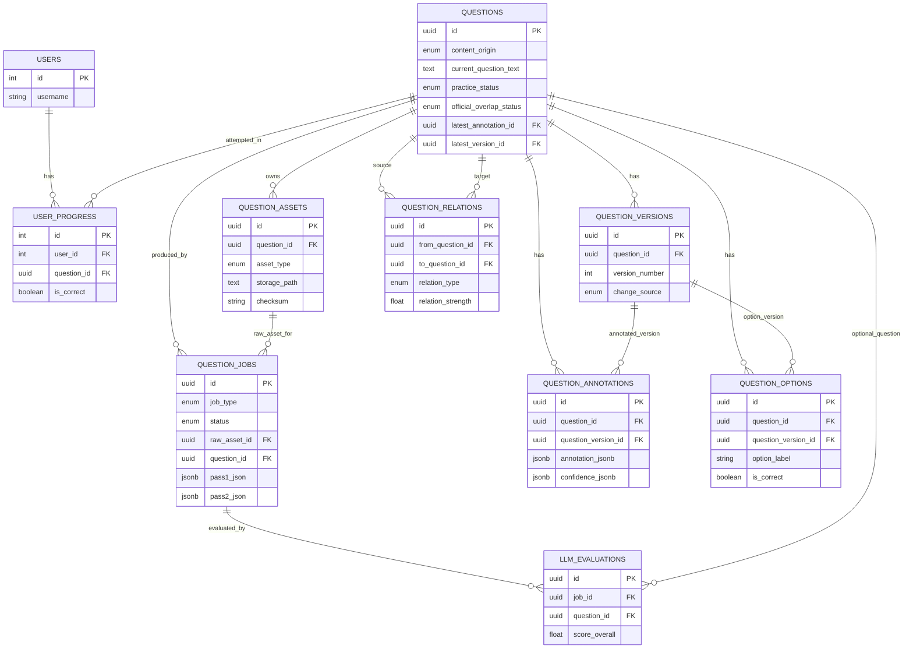
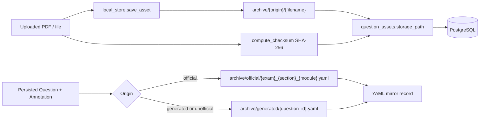
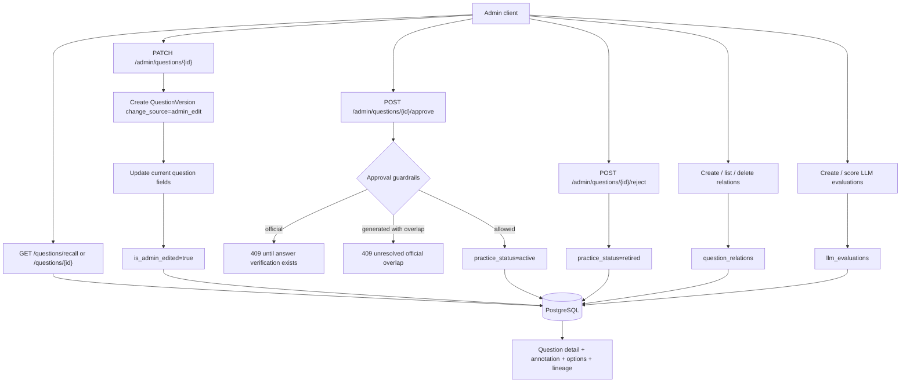
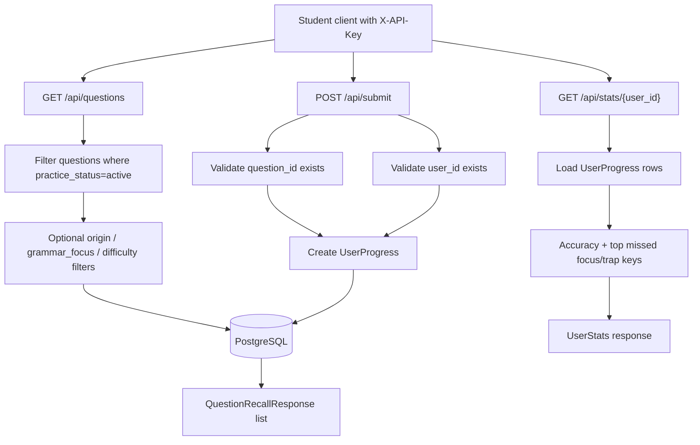

# DSAT Backend API and Database Review

Date reviewed: 2026-04-25

## Executive Summary

The backend is a FastAPI service for DSAT grammar question ingestion, LLM-based extraction and annotation, generated question creation, corpus review, student practice, user progress, and admin curation. The system is organized around two primary segments:

- **Corpus segment:** question jobs, questions, versions, annotations, answer options, source assets, question relations, and LLM evaluations.
- **Student segment:** users and user progress records, which read from the approved question corpus.

The core data flow is job-oriented. Upload, text ingest, generation, and reannotation endpoints create `QuestionJob` rows, then spawn in-process async background tasks that call LLM providers, parse JSON, validate the output, persist question records, and optionally export YAML archive files. The database layer is a lightweight async SQLAlchemy setup with one shared engine, an `async_sessionmaker`, and ORM models under `backend/app/models/db.py`.

The implementation is functional and reasonably modular, but there are a few important production-readiness concerns: background work is not durable, provider API-key selection can choose the wrong key, official metadata is not passed into the extraction prompt or validation merge, upload MIME validation is only partially implemented, local asset writes can overwrite same-named files, and some async ORM relationship access may be risky without eager loading.

## Repository Organization

```text
backend/
  app/
    main.py                 FastAPI app, lifespan, middleware, router registration
    config.py               Pydantic settings and environment-driven defaults
    database.py             Async SQLAlchemy engine/session/Base/get_db dependency
    auth.py                 X-API-Key admin/student dependencies
    middleware.py           Request ID correlation middleware
    logging_config.py       JSON/plain logging configuration
    routers/
      health.py             Health and DB connectivity
      ingest.py             Official/unofficial/text ingestion and reannotation
      generate.py           Generated question jobs and comparison runs
      questions.py          Admin question recall/detail/version reads
      student.py            Student-facing practice, submit, stats, legacy user endpoints
      users.py              Admin user CRUD endpoints
      admin.py              Curation, approvals, relations, LLM evaluations
      dashboard.py          HTMX ingestion dashboard
    llm/
      base.py               Provider protocol and response dataclass
      factory.py            Provider construction and shutdown registry
      anthropic_provider.py Anthropic async client adapter
      openai_provider.py    OpenAI async client adapter
      ollama_provider.py    Ollama/OpenAI-compatible HTTP adapter
      retry.py              Retry decorator for LLM calls
    parsers/
      pdf_parser.py         PyMuPDF text/image extraction
      image_parser.py       Image base64 parser, not wired into ingestion pipeline
      json_parser.py        LLM JSON extraction and annotation normalization
      markdown_parser.py    Markdown parsing support
    pipeline/
      orchestrator.py       Job status state machine helper
      validator.py          Structural and ontology validation
      overlap.py            Automated official-overlap detection and persistence
    prompts/
      extract_prompt.py     Pass 1 extraction prompt
      annotate_prompt.py    Pass 2 annotation prompt with V3 rules context
      generate_prompt.py    Question generation prompt
    storage/
      local_store.py        Local asset storage and checksum helpers
      yaml_export.py        Official/generated YAML mirror exports
    models/
      db.py                 SQLAlchemy ORM database schema
      payload.py            API request/response Pydantic models
      ontology.py           Enumerations and allowed V3 ontology keys
  migrations/versions/      Alembic database migrations
  tests/                    Router, model, parser, provider, pipeline, auth tests
  docs/                     Existing backend documentation
```

## System Diagrams

### End-to-End Workflow

This diagram shows how the major subsystems connect from external clients through the API layer, background LLM workflows, database persistence, archive export, admin review, and student practice.



### API Service Component Map



### Ingestion and LLM Extraction Pipeline



### Generation Pipeline



### Database Relationship Diagram



### Storage and Archive Flow



### Admin Curation Flow



### Student Practice Flow



## Runtime Wiring

`backend/app/main.py` creates the FastAPI application with title `DSAT Grammar API` and version `0.1.0`. On startup, it loads settings and configures logging. On shutdown, it closes registered LLM providers and disposes the SQLAlchemy engine.

Middleware:

- `CORSMiddleware` allows all origins, methods, and headers.
- `RequestIDMiddleware` accepts or generates `X-Request-ID`, stores it on `request.state`, exposes it through a `ContextVar`, and returns it on the response.

Registered routers:

- `/` health
- `/questions/*` admin corpus reads
- `/api/*` student practice endpoints
- `/admin/*` admin curation endpoints
- `/ingest/*` ingestion and reannotation endpoints
- `/generate/*` generation endpoints
- `/users/*` admin user CRUD
- `/dashboard/*` admin dashboard HTML/fragments

## Configuration

`backend/app/config.py` defines `Settings` loaded from `.env`.

Important settings:

- `database_url`: defaults to local PostgreSQL on port `5434`.
- `admin_api_keys`, `student_api_keys`: comma-separated API-key lists.
- `anthropic_api_key`, `openai_api_key`, `ollama_base_url`: LLM provider configuration.
- `raw_asset_storage_backend`, `local_archive_mirror`: storage configuration. Current implementation uses local filesystem storage.
- `default_annotation_provider`, `default_annotation_model`, `rules_version`: LLM defaults.
- `llm_retry_*`: retry settings defined, but providers currently use hard-coded decorator values.
- `ocr_*`: OCR/vision settings defined, but image OCR is not implemented in the ingestion route.
- `log_level`, `log_json`: runtime logging configuration.

Auth is API-key based through `X-API-Key`:

- `admin_required()` checks `admin_api_key_list`.
- `student_required()` checks `student_api_key_list`.

There is no per-user token identity, role model, password flow, or ownership enforcement. Student endpoints trust the submitted `user_id`.

## Database Manager and Session Layer

`backend/app/database.py` is the database manager:

- Creates a global async SQLAlchemy engine using `create_async_engine(settings.database_url, pool_size=5, max_overflow=10, pool_pre_ping=True)`.
- Creates `async_session = async_sessionmaker(engine, class_=AsyncSession, expire_on_commit=False)`.
- Defines `Base` as the ORM declarative base.
- Exposes `get_db()` as the FastAPI dependency yielding an `AsyncSession`.

This design is simple and conventional for a FastAPI async app. Every request receives a session from `get_db()`. Background jobs that run after request return create a fresh session via `async_session()`.

Potential database/session concerns:

- Relationship lazy-loading is used in a few async routes, such as `q.versions` in admin edit and reannotation. Async SQLAlchemy lazy loading can raise `MissingGreenlet` unless configured or already loaded by tests/session behavior. Safer patterns are explicit `select()` queries or eager loading.
- There are no explicit transaction scopes around multi-row writes beyond manual `commit()` calls. For current usage this is acceptable, but larger pipelines would be clearer with `async with db.begin()` blocks.
- No indexes are declared for common corpus filters such as `questions.practice_status`, `questions.content_origin`, `questions.latest_annotation_id`, `question_jobs.created_at`, or `user_progress.user_id`. The schema may need these as data volume grows.

## Database Schema and Connections

The ORM schema lives in `backend/app/models/db.py`; Alembic migrations live under `backend/migrations/versions`.

### Corpus Tables

`question_jobs`

- Tracks ingest, generate, reannotate, and overlap-check work.
- Stores job type, content origin, input format, status, provider/model/prompt/rules versions, raw asset link, pass 1 JSON, pass 2 JSON, validation errors, comparison group, optional output question ID, and timestamps.
- Connects to `question_assets` through `raw_asset_id`.
- Connects to `questions` through `question_id`.

`questions`

- Canonical current question record.
- Stores origin, source exam/section/module/question metadata, stimulus/stem type keys, current text/passage/correct answer/explanation, practice status, official-overlap status, lineage, admin-edit flags, latest annotation/version pointers, and timestamps.
- Self-references for `canonical_official_question_id` and `derived_from_question_id`.
- Connects to versions, annotations, options, assets, relations, jobs, and user progress.

`question_versions`

- Immutable-ish snapshots of question text, passage, choices, correct answer, explanation, change source, editor, notes, and timestamp.
- Used for ingest, generation, admin edits, and reprocessing history.

`question_annotations`

- Stores LLM metadata and annotation JSON for a question version.
- Contains `annotation_jsonb`, `explanation_jsonb`, optional `generation_profile_jsonb`, and `confidence_jsonb`.
- `questions.latest_annotation_id` points to the current annotation.

`question_options`

- Stores normalized answer choices tied to question and version.
- Has columns for distractor analysis, plausibility, fit, failure mode, and competition metrics.
- Current persistence mostly fills label/text/is-correct/role; detailed option analysis is mainly retained in annotation JSON rather than these columns.

`question_assets`

- Tracks raw uploaded assets and storage paths.
- Stores origin, asset type, MIME type, page span, source metadata, checksum, and optional question link.

`question_relations`

- Represents relations between questions: official overlap, near duplicate, derived from, generated from, adapted from.
- Used by automated overlap detection and admin confirmation workflows.

`llm_evaluations`

- Stores human/model review scores for LLM jobs and generated/annotated questions.
- Supports provider/model comparison and recommendation metadata.

### Student Tables

`users`

- Integer primary key, unique username, created timestamp.

`user_progress`

- Records attempts by user and question.
- Stores correctness, selected option, missed grammar focus, missed syntactic trap, and timestamp.
- Connects student performance to corpus questions.

### Migration State

Current migrations:

- `001_initial_schema.py`: creates enum types and 10 base tables.
- `002_expand_question_relation_detection_method.py`: expands relation detection method to text.
- `003_add_source_section_code.py`: adds `questions.source_section_code`.

## API Service Surface

### Health

`GET /`

- Runs `SELECT 1` through the async DB session.
- Returns status, API version, and database connection state.

### Questions API

Admin-only routes under `/questions`:

- `GET /questions/recall`: active question recall with optional filters for grammar focus, difficulty, origin, limit, offset.
- `GET /questions/{question_id}`: full detail including current question fields, latest annotation, options, lineage, timestamps.
- `GET /questions/{question_id}/versions`: version history for a question.

The recall filters join `QuestionAnnotation` only when annotation-backed filters are present. The implementation then fetches latest annotations per question one by one, which is simple but can become an N+1 query pattern.

### Dashboard API

`GET /dashboard`

- Returns a single HTMX/Tailwind admin dashboard page for ingesting official PDFs, image uploads, and pasted text.

`GET /dashboard/jobs`

- Admin-only fragment that returns a recent job table, refreshed by HTMX.

The dashboard stores the admin API key in browser `localStorage` and injects it into HTMX requests.

## Ingestion and LLM Extraction

The ingestion router is `backend/app/routers/ingest.py`.

### Entry Points

`POST /ingest/official/pdf`

- Admin-only.
- Reads an uploaded PDF with a 50 MB size cap.
- Saves the asset to the local archive under `official`.
- Computes SHA-256 checksum.
- Parses PDF text and embedded images with PyMuPDF.
- Creates `QuestionAsset`.
- Creates `QuestionJob` with status `parsing`, origin `official`, input format `pdf`, raw text in `pass1_json`, and source metadata.
- Starts `_run_pipeline_with_session(job_id)` using `asyncio.create_task`.

`POST /ingest/unofficial/file`

- Admin-only.
- Accepts PDF, text, markdown, or JSON-like content.
- Rejects images with 422 because OCR is not implemented.
- Saves `QuestionAsset`, parses raw text, creates `QuestionJob`, starts the background pipeline.

`POST /ingest/text`

- Admin-only.
- Accepts pasted text and an origin of `official` or `unofficial`.
- Stores raw text and optional source metadata directly on `QuestionJob.pass1_json`.
- Starts the background pipeline.

`POST /ingest/unofficial/batch`

- Admin-only.
- Iterates over files and delegates to the single-file ingestion function.

`POST /ingest/reannotate/{question_id}`

- Admin-only.
- Finds the latest existing job for the question that has `pass1_json`.
- Creates a `reannotate` job and runs annotation without re-extraction.

`GET /ingest/jobs/{job_id}`

- Admin-only.
- Returns basic job status and question ID.
- The route prepares validation errors but does not include them in `JobResponse`.

### Pipeline Stages

`_run_pipeline(job, db)` handles ingest jobs.

1. Provider selection:
   - `get_provider(job.provider_name, api_key=settings.anthropic_api_key or settings.openai_api_key, base_url=settings.ollama_base_url, default_model=job.model_name)`
   - Supported providers: Anthropic, OpenAI, Ollama.

2. Raw text fetch:
   - Reads `raw_text` from `job.pass1_json`.
   - If missing, marks job failed.

3. Pass 1 extraction:
   - Sets job status to `extracting`.
   - Builds prompt with `build_extract_prompt(raw_text[:30000])`.
   - Calls LLM provider.
   - Parses output with `extract_json_from_text`.
   - Stores extracted structured JSON plus `_llm_meta` in `job.pass1_json`.

4. Pass 2 annotation:
   - Sets job status to `annotating`.
   - Builds prompt with `build_annotate_prompt(extract_json)`.
   - Calls LLM provider.
   - Parses JSON and normalizes nested annotation with `normalize_annotation`.
   - Stores annotation plus `_llm_meta` in `job.pass2_json`.

5. Overlap detection:
   - For `unofficial` and `generated` origins, sets job status to `overlap_checking`.
   - Compares passage/question token overlap and grammar focus against official active/draft questions.
   - Persists possible relations after the new question exists.

6. Validation:
   - Sets job status to `validating`.
   - Merges extracted and annotated data.
   - Calls `validate_question`.
   - Blocking errors produce `needs_review` and stop persistence.

7. Persistence:
   - Creates `Question`, `QuestionVersion`, `QuestionAnnotation`, and `QuestionOption` rows.
   - Links raw asset to question.
   - Persists overlap relations if any.
   - Sets `job.question_id`.
   - Commits the transaction.

8. YAML export:
   - Official questions export into grouped official YAML files when exam/module data is available.
   - Unofficial/generated questions export into generated YAML files.

### Ingestion Status Behavior

The declared state machine supports:

```text
pending -> parsing -> extracting -> annotating -> overlap_checking -> validating -> approved|needs_review|failed
```

Generated jobs include a `generating` state in the state machine, but the generation route currently starts jobs at `extracting` and moves directly to `annotating` after the generation LLM call.

### Official vs Unofficial Handling

Official ingestion:

- Requires source metadata during validation: `source_exam_code`, `source_module_code`, `source_question_number`.
- Persists official questions as `practice_status="draft"`.
- Sets job to `needs_review` if origin is official, even when validation passes.
- Admin approval for official questions is currently blocked until answer verification is implemented.

Unofficial ingestion:

- Persists questions as active when validation passes.
- Runs official-overlap detection.
- Marks `official_overlap_status` as `possible` if overlaps are found.

## Generation

The generation router is `backend/app/routers/generate.py`.

### Entry Points

`POST /generate/questions`

- Admin-only.
- Accepts `GenerationRequest` with target grammar role, grammar focus, syntactic trap, difficulty, optional source question IDs, provider, and model.
- Creates a `QuestionJob` with type `generate`, origin `generated`, input format `spec`, and status `extracting`.
- Starts `_run_generate_pipeline` in an in-process background task.

`POST /generate/questions/compare`

- Admin-only.
- Accepts `GenerationCompareRequest`.
- Creates one job per provider with a shared `comparison_group_id`.
- Starts one background task per provider.

`GET /generate/runs/{run_id}`

- Admin-only.
- Returns a single job if `run_id` is a job ID.
- Otherwise treats `run_id` as a comparison group ID and returns all group jobs.

### Generation Pipeline

`_run_generate_pipeline(job, db, request_data)`:

1. Builds a generation prompt from request data.
2. Calls the selected LLM with higher temperature (`0.7`).
3. Parses generated JSON into `job.pass1_json`.
4. Builds and runs annotation prompt on generated question JSON.
5. Stores normalized annotation in `job.pass2_json`.
6. Validates the merged data with `content_origin="generated"` and generation lineage.
7. Creates `Question`, `QuestionVersion`, `QuestionAnnotation`, and `QuestionOption` rows.
8. Sets generated questions to `practice_status="draft"`.
9. Stores `generation_source_set` on the question.
10. Exports generated question YAML.

Generated questions are not automatically active. Admin approval is required, and approval rejects generated questions that have unresolved official overlap.

## Storage

### Raw Asset Storage

`backend/app/storage/local_store.py` implements local filesystem storage.

- `_archive_dir()` creates `settings.local_archive_mirror`.
- `save_asset(filename, content, subfolder)` writes the content under the archive root/subfolder.
- `compute_checksum(content)` returns SHA-256.
- `read_asset(storage_path)` reads bytes from disk.

The current implementation writes to `target / filename` without unique path generation. Uploading the same filename twice will overwrite the existing file while both database rows can point to the same path.

### YAML Archive Export

`backend/app/storage/yaml_export.py` mirrors persisted questions into YAML:

- Official questions are grouped by exam, optional section, and module:
  - `archive/official/{exam_code}_{section_code}_{module_code}.yaml`
  - `archive/official/{exam_code}_{module_code}.yaml` if section is missing
- Generated/unofficial exports are standalone:
  - `archive/generated/{question_id}.yaml`

Official export upserts by question number. Generated export writes one file per question. Export errors are caught and logged, so database persistence is the source of truth.

## LLM Provider Layer

The LLM abstraction is intentionally small:

- `LLMProvider.complete(system, user, model=None, max_tokens=4096, temperature=0.2)`
- Returns `LLMResponse(raw_text, model, provider, latency_ms, token_usage, error)`.

Providers:

- `AnthropicProvider`: uses `anthropic.AsyncAnthropic.messages.create`.
- `OpenAIProvider`: uses `openai.AsyncOpenAI.chat.completions.create`.
- `OllamaProvider`: calls `/v1/chat/completions` through `httpx.AsyncClient`, expecting OpenAI-compatible responses.

Retry:

- `with_retry` retries async calls on HTTP 429/5xx, `httpx` request errors, timeouts, and `ConnectionError`.
- Decorators currently hard-code `max_attempts=3`, `base_delay=1.0`, and `max_delay=30.0`.

Provider lifecycle:

- `get_provider` constructs a new provider for each pipeline call and stores it in a registry.
- App shutdown calls `close_all_providers()`, which closes providers that expose `close()` such as Ollama.

## Validation and Overlap Detection

### Validation

`backend/app/pipeline/validator.py` enforces:

- Required `question_text`.
- Exactly four answer options.
- Correct label must be `A`, `B`, `C`, or `D`.
- Review warning if explanation is missing.
- Official questions must have source exam code, module code, and question number.
- Generated questions must have generation lineage.
- Review warnings for ontology key mismatches.
- Review warning for long short explanations.

Blocking errors set jobs to `needs_review` and prevent normal question persistence in the ingest/generate pipelines.

### Overlap Detection

`backend/app/pipeline/overlap.py` compares unofficial/generated questions against official active/draft questions.

Signals:

- Jaccard similarity over passage word sets.
- Jaccard similarity over question text word sets.
- Grammar focus match from latest annotation.

If strength exceeds threshold:

- `> 0.6`: `overlaps_official`
- `>= 0.4`: `near_duplicate`

Persisted overlap rows are unconfirmed until admin action. Admin can confirm overlap, clear overlap, or create/delete relations manually.

## User Management

There are two user endpoint groups.

### Admin User Routes: `/users`

Defined in `backend/app/routers/users.py`.

- `POST /users`: create user, admin-only.
- `GET /users`: list users, admin-only, paginated.
- `GET /users/{user_id}`: get user, admin-only.
- `DELETE /users/{user_id}`: delete user, admin-only.

Concern: this delete route does not delete `UserProgress` first and the ORM does not define cascade deletion. If progress exists, the database can reject the delete due to foreign-key constraints.

### Student/Legacy User Routes: `/api/users`

Defined in `backend/app/routers/student.py`.

- `POST /api/users`: create user, currently no API-key dependency.
- `GET /api/users`: list users, admin-only.
- `GET /api/users/{user_id}`: get user, student API-key required.
- `DELETE /api/users/{user_id}`: delete user and progress, admin-only.

There is overlap between `/users` and `/api/users`. The `/api/users` create route is unauthenticated, while `/users` create is admin-only. The project should decide whether public self-registration is intended and document/enforce one consistent user-management surface.

## Student Practice and Progress

Student routes live under `/api`.

`GET /api/questions`

- Student API key required.
- Returns active questions with optional origin, grammar focus, and difficulty filters.
- Similar to admin recall, joins latest annotation only when annotation-backed filters are used.

`POST /api/submit`

- Student API key required.
- Validates question UUID exists.
- Validates user exists.
- Creates `UserProgress` with selected option, correctness, and optional missed focus/trap keys.

`GET /api/stats/{user_id}`

- Student API key required.
- Reads all progress rows for a user.
- Computes total answered, total correct, accuracy, top missed grammar focus keys, and top missed syntactic trap keys.

Security model note: any holder of the student API key can submit or read stats for any `user_id`. This is acceptable for a trusted local/admin environment, but not for multi-user production.

## Admin Functions

Admin routes live under `/admin`.

### Question Curation

`PATCH /admin/questions/{question_id}`

- Creates a new `QuestionVersion`.
- Updates current question fields.
- Sets `is_admin_edited=True`.
- Updates `latest_version_id`.
- Does not currently update existing `QuestionOption` rows when text or correct answer changes; it only serializes choices into the new version snapshot.

`POST /admin/questions/{question_id}/approve`

- Sets `practice_status="active"` with guardrails:
  - Official questions cannot be approved until answer verification is implemented.
  - Generated questions with unresolved overlap cannot be approved.

`POST /admin/questions/{question_id}/reject`

- Sets `practice_status="retired"`.

`POST /admin/questions/{question_id}/confirm-overlap`

- Finds official overlap/near-duplicate relations.
- Requires exactly one official candidate.
- Sets `official_overlap_status="confirmed"`.
- Sets `canonical_official_question_id`.
- Marks matching relations human-confirmed.

`POST /admin/questions/{question_id}/clear-overlap`

- Sets overlap status back to `none`.
- Clears canonical official question pointer.

### Relations

- `GET /admin/relations`: list relations with optional source question and relation type filters.
- `POST /admin/relations`: create relation after validating both questions and relation type.
- `DELETE /admin/relations/{relation_id}`: delete relation.

### LLM Evaluations

- `POST /admin/evaluations`: create evaluation record linked to a job and optional question.
- `POST /admin/evaluations/{evaluation_id}/score`: update scores, review notes, and recommendation flag.

This supports model/provider QA and comparison workflows.

## API Contracts

Pydantic payloads live in `backend/app/models/payload.py`.

Key response/request models:

- `QuestionRecallResponse`: compact practice/listing record.
- `QuestionDetailResponse`: full current question view with annotation/options/lineage.
- `UserProgressCreate`: answer attempt submission.
- `UserStats`: aggregate student performance.
- `AdminEditRequest`: admin edit body.
- `EvaluationScoreRequest`: scoring body for evaluations.
- `GenerationRequest`: single generation request.
- `GenerationCompareRequest`: provider comparison generation request.
- `JobResponse`: job status response.
- `ReannotateRequest`: provider/model for reannotation.
- `UserCreate`, `UserResponse`: user CRUD contracts.

## Key Connections Between Components

```text
Client
  -> FastAPI router
  -> auth dependency, when required
  -> get_db async session
  -> ORM model query/write
  -> PostgreSQL
```

Ingestion:

```text
Upload/text
  -> ingest router
  -> local_store.save_asset, when file input
  -> parser, when PDF/JSON/text
  -> QuestionAsset
  -> QuestionJob
  -> asyncio background task
  -> LLM provider
  -> extract_json_from_text
  -> validate_question
  -> Question/Version/Annotation/Options
  -> overlap detection, when unofficial/generated
  -> YAML export
```

Generation:

```text
GenerationRequest
  -> QuestionJob
  -> asyncio background task
  -> generate prompt
  -> LLM provider
  -> annotation prompt
  -> validation
  -> generated Question/Version/Annotation/Options
  -> YAML export
```

Student practice:

```text
Student API key
  -> /api/questions reads active Questions
  -> /api/submit writes UserProgress
  -> /api/stats aggregates UserProgress by user
```

Admin curation:

```text
Admin API key
  -> /questions reads corpus
  -> /admin patches status, versions, relations, evaluations
  -> /users manages user records
```

## Notable Review Findings and Risks

1. **LLM provider API-key selection can pass the wrong key.**
   In ingestion and generation, provider construction passes `settings.anthropic_api_key or settings.openai_api_key` for all providers. If both keys are set and provider is `openai`, the OpenAI provider receives the Anthropic key. This should be provider-specific.

2. **Official source metadata is not injected into extraction or validation.**
   Official ingest stores form metadata in `job.pass1_json["source_metadata"]`, but `_run_pipeline` calls `build_extract_prompt(raw_text[:30000])` without passing that metadata. Validation requires official `source_exam_code`, `source_module_code`, and `source_question_number` from the merged extracted/annotated payload. If the LLM does not infer them from text, official ingest will go to review or fail persistence expectations.

3. **Background jobs are in-process and not durable.**
   `asyncio.create_task` work can be lost if the process restarts, a worker exits, or deployment uses multiple workers without shared task coordination. The `QuestionJob` table provides persistence, but there is no recovery worker, queue, lease, or retry daemon.

4. **Upload MIME validation is incomplete.**
   `ALLOWED_MIME` exists, and docs say MIME is validated, but ingestion routes do not consistently enforce it. Official PDF ingest attempts PDF parsing directly; unofficial upload rejects images but otherwise infers type from MIME.

5. **Local asset writes can overwrite existing uploads.**
   `save_asset` writes to `archive/{subfolder}/{filename}`. Duplicate filenames overwrite prior files while previous `QuestionAsset` rows still point to the same path.

6. **Admin edit does not update normalized option rows.**
   `PATCH /admin/questions/{question_id}` creates a version snapshot and updates current question fields, but existing `QuestionOption` rows remain unchanged if choices or correct answer need to change. The current request model does not support editing option text.

7. **Detailed distractor metadata is not normalized into `question_options`.**
   The schema has rich option-analysis columns, and the annotation prompt requests per-option analysis, but persistence mostly fills only label/text/correct/role. This limits SQL-level analytics unless consumers read nested annotation JSON.

8. **Duplicate user APIs have inconsistent auth and delete behavior.**
   `/users` is admin-only but delete may fail with progress rows. `/api/users` includes unauthenticated user creation and a delete path that explicitly deletes progress. The two surfaces should be reconciled.

9. **Student API key is not user identity.**
   Student endpoints allow a caller with the shared student key to submit or read stats for any `user_id`. Fine for controlled/internal use, not safe for public multi-user deployment.

10. **Async ORM lazy relationship access may be fragile.**
    Code paths such as `q.versions` can trigger lazy loads under async SQLAlchemy. Explicit selects or eager loading would be safer and easier to reason about.

11. **Status semantics are inconsistent around generation.**
    The state machine includes `generating`, but generation jobs start at `extracting` and skip `generating`. This can confuse dashboard/status consumers.

12. **Configured retry settings are not used.**
    `Settings` exposes retry knobs, but provider methods use decorator constants. Runtime retry tuning requires code changes today.

13. **CORS and default API keys are development-oriented.**
    Allow-all CORS and default keys like `admin-key-change-me` should be treated as local/dev defaults only.

## Suggested Follow-Up Work

Priority fixes:

1. Select LLM API keys by provider name.
2. Pass source metadata into extraction prompts and merge source metadata into validation/persistence for official ingest.
3. Make uploaded asset paths unique, for example by prefixing checksum or asset ID.
4. Reconcile `/users` and `/api/users` routes into one intended user-management contract.
5. Replace async relationship lazy access with explicit queries or eager loading.

Production hardening:

1. Move background jobs to a durable queue/worker, or add a startup job recovery loop for non-terminal `QuestionJob` rows.
2. Enforce MIME/content validation and extension checks.
3. Add DB indexes for common filters and job dashboard sorting.
4. Store normalized distractor analysis in `question_options`.
5. Add per-user authentication/authorization if this becomes externally exposed.
