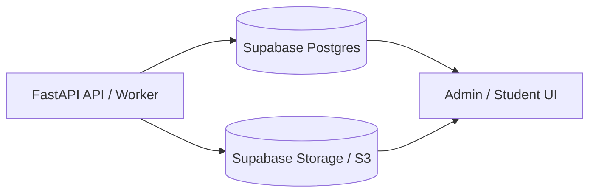

# Future Features

## Prompt Caching for Pass 2 Annotation (Claude + Ollama) `[DONE — 2026-05-23]`

When the ingestion pipeline uses Claude (Anthropic) as the annotation provider,
the static grammar/reading rules block should be marked with `cache_control` so
it is only billed at full price on the first call per domain per module. All
subsequent same-domain calls in the same job would hit the cache.

### Token savings estimate — 33-question module

| Domain | Questions | System prompt tokens | Without caching | With caching (10% rate on repeats) | Saved |
|---|---|---|---|---|---|
| Grammar | 16 | 10,300 | 164,800 | 10,300 + 15 × 1,030 = **25,750** | **139,050** |
| Reading | 17 | 17,500 | 297,500 | 17,500 + 16 × 1,750 = **45,500** | **252,000** |
| **Total** | **33** | — | **462,300** | **71,250** | **~391,000 (85%)** |

These are system-prompt tokens only. The per-question user message (~1–2K tokens)
is not cached and remains unchanged. At Claude Sonnet pricing ($3/MTok input,
$0.30/MTok cache read), a 33-question module drops from ~$1.39 to ~$0.23 in
annotation input cost.

### Implementation

In `build_annotate_prompt()` (`backend/app/prompts/annotate_prompt.py`), split
the message into two parts and add a cache breakpoint after the static rules
block:

```python
# system message with cache_control on the static rules block
messages = [
    {
        "role": "user",
        "content": [
            {
                "type": "text",
                "text": rules_context,          # _grammar_context() or _reading_context()
                "cache_control": {"type": "ephemeral"},
            },
            {
                "type": "text",
                "text": per_question_prompt,    # the variable part
            },
        ],
    }
]
```

The `cache_control` marker is silently ignored by non-Anthropic providers, so
no provider-specific branching is needed.

**Prerequisite:** Pass 2 must be routed to Claude (see "Pass 2 Annotation
Efficiency Optimization → Provider Choice" below for the full rationale).
Domain-sorting (lever #2 in that section) should also be applied so grammar and
reading calls run in contiguous batches — this maximises cache hits within a job.

---

## Admin Dashboard — Ingestion Status Overview

There is currently no admin API endpoint or dashboard view that surfaces the health of the full practice test ingestion pipeline. Assessment is only possible by querying the database directly with raw SQL. This feature would expose that data through a dedicated endpoint.

### Why It Matters

- The ingestion pipeline processes 16+ modules across 9 tests, each with its own job status, question count, and data-quality signals.
- Without a dashboard view, identifying failed jobs, short-count modules, duplicate jobs, and null question numbers requires direct DB queries — not suitable for non-technical reviewers.
- Post-ingest QA (question count vs. expected, annotation coverage, stimulus attachment rate) is currently manual.

### Proposed Endpoint

`GET /admin/ingestion/status`

Returns a per-module summary row for every `question_jobs` entry tied to an official test asset, including:

| Field | Description |
|---|---|
| `source_name` | PDF filename (`Test_N_digital_sec01_modM.pdf`) |
| `job_id` | UUID of the ingestion job |
| `status` | `approved`, `needs_review`, `failed` |
| `question_count` | Questions linked to this job |
| `expected_count` | Expected question count (configurable per module, default 33) |
| `count_delta` | `question_count - expected_count` (negative = short) |
| `with_correct_answer` | Questions with at least one `is_correct=TRUE` option |
| `annotated` | Questions with a `latest_annotation_id` |
| `with_stimulus` | Questions with at least one stimulus asset attached |
| `null_qnum_count` | Questions missing `source_question_number` in annotation JSONB |
| `duplicate_job` | `true` if multiple non-failed jobs exist for this source |
| `ingested_at` | Job creation date |

### Optional Dashboard Panel

A read-only admin UI table (sortable by status, delta, test number) with color-coded rows:
- Green: `approved`, count == expected
- Yellow: `needs_review` or count within 1–2 of expected
- Red: `failed` or count short by more than 2, or duplicate job detected

### Implementation Notes

- Query joins `question_jobs → question_assets → question_job_questions → questions → question_annotations → question_options → question_stimulus_assets`
- Duplicate detection: group by `source_name`, flag if `COUNT(job_id) > 1` for non-failed jobs
- Expected count per module could be stored in a config table or hardcoded as 33 (standard SAT module size)
- Should support an optional `?test=4&module=1` filter for targeted polling


## OCR / Layout Provenance For Ingestion

The ingestion pipeline can currently persist the final separated question structure, but it does not yet preserve page-level OCR/layout provenance. That provenance becomes important when extraction quality depends on where text appeared on the page, not just what text was read.

### When It Matters

- **Tables, charts, and graphs:** PyMuPDF or OCR may flatten rows, columns, axes, labels, legends, and values into plain text. Provenance helps preserve the original layout and data relationships.
- **Multi-question pages:** If OCR misses or merges one question, provenance can identify the exact page or region where the failure happened.
- **Answer choice alignment:** OCR can separate labels from option text or reorder nearby choices. Layout provenance helps verify that A/B/C/D pairings stayed intact.
- **Official-source auditability:** Stored official questions should be traceable back to the exact source PDF page, crop, or region.
- **Failed-ingestion debugging:** If a question disappears, provenance can show whether OCR omitted it, the extractor skipped it, or validation rejected it.
- **Selective reprocessing:** The backend could rerun only failed pages, crops, or layout blocks instead of reprocessing an entire PDF.
- **Human review UI:** Admin reviewers could compare the source crop beside the extracted question and approve or correct the result faster.
- **OCR benchmarking:** Benchmarks could show which OCR model failed on which page, table, or region instead of only reporting final question counts.

### Backend Value

This is not required for basic text-layer PDFs, but it is valuable for reliable ingestion of real SAT PDFs with scanned pages, dense layouts, tables, charts, graphs, or figures. The forced GLM-OCR benchmark that missed Question 11 is a concrete example: without provenance, the backend only knows that a question is missing; with provenance, it could identify the failed page/region and trigger targeted reprocessing.

### Proposed Data To Preserve

- source PDF path / asset ID
- page number
- rendered page image path
- optional crop image path
- extraction method per page or region: `pymupdf`, `glm_ocr`, `vlm_layout`, etc.
- diagnostic reason for visual processing
- raw PyMuPDF text
- OCR text
- structured table blocks when available
- chart/graph descriptions when available
- question-number range detected on the page
- confidence or validation warnings

### Future Implementation Direction

1. Add page diagnostics after PyMuPDF parsing.
2. Detect layout-sensitive pages using text density, table-like patterns, embedded images, and prompt cues such as "table," "graph," "chart," or "figure."
3. Render only flagged pages or crops.
4. Run GLM-OCR for text/table-heavy regions and a layout-aware VLM for charts/graphs.
5. Store provenance in job JSON and, if needed, a dedicated database table.
6. Surface provenance and source crops in the admin review workflow.

## Pass 2 (Annotation) Efficiency Optimization

The ingestion pipeline's Pass 2 annotation step is the dominant runtime cost of a
job. A 27-question module took ~22 minutes in observed runs, almost entirely in
this phase. The work below would cut wall-clock time substantially with low risk,
and optionally reduce token cost with a larger refactor.

### Measured Cost

A 27–33 question module triggers **one sequential LLM call per question**. Each
call carries a system prompt that is ~99% a static rules reference:

- **~10,300 input tokens** for grammar-domain questions (`_grammar_context()`)
- **~17,500 input tokens** for reading-domain questions (`_reading_context()`)

That system prompt is **byte-identical for every question of the same domain** —
only the small user message (the per-question JSON) varies. A single module
therefore re-sends roughly 300–470K tokens of unchanging rules text, one
question at a time, fully serialized.

Relevant code: `backend/app/routers/ingest.py` per-question loop at the Pass 2
section (`for i, q_data in enumerate(questions_data)`), and
`backend/app/prompts/annotate_prompt.py` (`build_annotate_prompt`,
`_grammar_context`, `_reading_context`).

### Optimization Levers (ranked)

**1. Parallelize the annotation calls — biggest wall-clock win.**
The loop currently `await`s `provider.complete(...)` one question at a time.
Gather the LLM calls with a bounded semaphore (4–6 concurrent), then run
validate/persist sequentially afterward (persistence must stay serial because of
the per-question DB savepoints). Expected: ~22 min → ~4–6 min. No token-cost
change. Risk: concurrent load on the `qwen3-vl:235b-instruct-cloud` endpoint —
confirm it tolerates parallel requests / rate limits first. Moderate refactor:
split the loop into a parallel "annotate all" phase producing a list, then a
serial "validate + persist" phase.

**2. Sort questions by domain so identical prompts run consecutively — cheap.**
Ollama reuses a cached KV prefix across requests when the model stays loaded and
the prompt prefix is identical. Grammar and reading questions are currently
interleaved, so the 10K/17.5K-token prefix is repeatedly evicted. Sorting
`questions_data` by detected domain before the loop lets the prefix cache hit.
~10-line change, low risk, a real latency win even without parallelizing.

**3. Batch annotation — biggest token/cost win, highest risk.**
Annotate K questions per LLM call so one rules prompt is amortized over K
questions (K=5 → ~5× fewer rules-token resends). Risk: large output JSON, parse
fragility, harder per-question retry, possible quality dilution. Should be a
separate, carefully tested change.

**4. `lru_cache` the rules-file reads — trivial cleanup.**
`_grammar_context()` / `_reading_context()` re-read the ~20K-token rules
markdown files from disk on every question. Cache them with `functools.lru_cache`.
Tiny win (disk I/O, not LLM time), but free — worth doing alongside #1.

### Recommended Bundle

Implement **#1 + #2 + #4 together** as one commit: ~4–6 min wall-clock instead
of ~22 min, with no quality risk and no change to output format. Capture a
before/after timing baseline on the same module. Treat **#3 (batching)** as a
separate follow-up where the token-cost savings live.

### Provider Choice: Would Claude or OpenAI Help?

Yes — meaningfully — primarily through one mechanism the current setup cannot
fully exploit: **prompt caching**. Phase 2's core inefficiency is re-sending an
identical 10–17.5K-token rules block on every call. Hosted providers cache it:

| Provider | Caching behavior | Effect on Phase 2 |
|---|---|---|
| **Anthropic (Claude)** | Explicit `cache_control` breakpoints; ~90% cost cut on cache reads + faster time-to-first-token | First call per domain writes the cache; all remaining same-domain calls hit it. Biggest win. |
| **OpenAI** | Automatic for >1024-token identical prefixes; ~50% discount + latency gain | Free, zero code, but smaller discount and less control. |
| **Ollama `qwen3-vl:235b-instruct-cloud` (current)** | Only opportunistic KV-prefix reuse if the model stays loaded and prompts run back-to-back — fragile, not guaranteed | Why lever #2 (domain-sorting) is needed just to *maybe* get caching. |

Claude turns the unreliable lever #2 into a guaranteed ~90% reduction on the
repeated rules tokens — the single largest efficiency gain available.

**Other advantages of a hosted provider:**

- **Concurrency** — hosted Claude/OpenAI handle parallel requests well, so
  lever #1 (parallelize) works cleanly. The qwen cloud endpoint's concurrency
  limits are unknown and may throttle.
- **Instruction-following** — Claude is strong at structured-JSON annotation;
  it would likely also reduce the "unknown `stem_type_key`" enum-drift errors.
- **Clean to adopt** — Pass 2 annotation is **text-only** (it operates on the
  extracted question JSON, not images). Route *just Phase 2* to Claude while
  keeping the VLM (`qwen3-vl`) for Pass 1 vision extraction and OCR. Config
  already exposes `anthropic_api_key` / `openai_api_key`.

**Caveat:** Ollama cloud may be flat-rate or cheaper per raw token; Claude /
OpenAI bill per token. Prompt caching is what flips that math — the 300–470K
repeated rules tokens become ~90% cheaper on Claude, with a latency win too.
This does not replace levers #1/#3 — it stacks with them.

**Recommendation:** route Pass 2 to **Claude with explicit prompt caching** on
the rules block; keep the VLM for vision extraction and OCR.

**Implementation details:** see [Prompt Caching for Pass 2 Annotation (Claude provider)](#prompt-caching-for-pass-2-annotation-claude-provider) above for the exact `cache_control` code change and a per-module token/cost savings table (~391K tokens saved, 85% reduction, ~$1.16/module).

## Supabase-Centered Ingestion Persistence

The backend should treat FastAPI as a stateless API/worker layer. Anything that must be recalled later should be stored durably in Supabase/Postgres or object storage, not in FastAPI process memory.

### Durable State

Structured ingestion state should live in a single Postgres database, which can be Supabase Postgres:

- `question_assets`
- `question_jobs`
- `questions`
- `question_versions`
- `question_options`
- `question_annotations`
- future OCR/layout provenance tables
- future structured table/chart stimulus tables

Raw files and binary artifacts should live in object storage:

- source PDFs
- rendered page images
- page crops
- chart/table crops
- image assets needed for later review or UI rendering

For production, this should be Supabase Storage or S3-compatible storage rather than local disk.

### FastAPI Runtime State

FastAPI should only hold temporary runtime state while a request or background job is actively executing:

- in-progress OCR calls
- in-progress LLM calls
- temporary parsed text
- temporary page/crop files before upload to object storage

No question, source asset, OCR output, chart/table data, or provenance needed for later recall should depend on FastAPI memory.

### Target Architecture



Supabase Postgres should store the structured metadata and relational links. Object storage should store PDFs, rendered pages, crops, and other binary artifacts. The database should store object-storage paths so any UI can reconstruct the source context for a question.

## Python-Based Ingestion Runner

The current ingestion runners are Bash scripts: `backend/run_full_ingestion.sh`
for full-batch official PDF ingestion and `.claude/skills/ingestion-test/run.sh`
for single-test/dev workflow. Both scripts are mostly orchestration and can be
ported cleanly to a Python CLI.

### Target Behavior

A Python runner should support both single-test and full-batch modes:

- discover official PDFs under `TESTS/DATA_SRC/2025-2026 Tests Answers/VERBAL`
- parse `Test_N_digital_secXX_modYY.pdf` metadata into exam, section, and module codes
- submit each PDF to `/ingest/official/pdf`
- poll `/ingest/jobs/{job_id}` until a terminal state
- write per-PDF JSON results to a configurable results directory
- print a structured summary of approved, needs-review, failed, submit-failed, and timed-out jobs
- optionally query local Postgres for extracted/created counts and validation-error summaries

### Advantages Over Bash

- **Reliable JSON handling:** avoid repeated shell pipelines such as `echo | python3 -c`.
- **Clearer error handling:** distinguish duplicate checksum, malformed response, server unavailable, timeout, failed job, and database unavailable.
- **Duplicate recovery:** when the API reports an already-ingested file, the runner can look up or reuse the existing job instead of returning `no_job_id`.
- **Better reporting:** produce structured summaries with validation errors by step, extracted/created counts, and per-test outcomes.
- **Configurable CLI:** support flags such as `--target`, `--full`, `--results-dir`, `--timeout`, `--poll-interval`, `--api-base`, and `--api-key`.
- **More portable:** reduce dependence on Bash-specific behavior, `sed`, `tail`, curl formatting, and shell quoting.
- **Easier testing:** filename parsing, response handling, polling, timeout behavior, and summary aggregation can be covered with unit tests.
- **Future storage workflows:** Python can more naturally support local Postgres inspection, Supabase migration metadata, object-storage checks, and retry/skip policies.

### Implementation Direction

Create a Python CLI such as `backend/scripts/run_ingestion.py` or
`scripts/run_ingestion.py`. Keep the existing shell scripts initially as thin
compatibility wrappers that call the Python implementation. Once the Python
runner is stable, retire the duplicated Bash logic.

Use `argparse`, `pathlib`, `json`, and either `httpx` or the existing project
HTTP dependency. Keep server/Docker startup behavior optional, because the full
batch runner should be usable against any already-running backend.

## Granular Academic Topic Taxonomy

**Status:** Schema exists but vocabulary is incomplete. Ready for implementation when a new ingestion database is created or when migrating existing questions.

**Database Location:**
- Table: `questions` (or `question_annotations` for versioned topics)
- Fields: `topic_broad` (controlled vocab), `topic_fine` (free-text / controlled vocab TBD)
- Current broad categories only: `science`, `history`, `literature`, `social_studies`, `humanities`, `arts`, `economics`, `technology`, `environment`

**Code References:**
- `/home/jb/DSAT_REDUX_MD/backend/app/models/annotation.py` lines 30-31: Pydantic model defines `topic_broad` and `topic_fine`
- `/home/jb/DSAT_REDUX_MD/backend/app/models/db.py` line 74: Database column `source_subject_code` (free-text, e.g., "ENG")
- `/home/jb/DSAT_REDUX_MD/vocabulary/master.json`: Controlled vocabulary for `TOPIC_BROAD_KEYS` (9 categories)
- `/home/jb/DSAT_REDUX_MD/backend/app/models/ontology.py` lines 444-448: Generated constants from master.json

**The Gap:**

The current system only tracks 9 broad topic categories. Specific academic subjects like "Cherokee history," "marine biology / kelp forests," "Jazz tap dance," "Impressionist art," "Native American artists," etc., all collapse into broad buckets (`history`, `science`, `arts`). There is no granular subject taxonomy to:

1. Filter questions by specific academic discipline
2. Analyze coverage across specific subjects (e.g., "do we have enough Indigenous history passages?")
3. Identify content gaps in the question bank
4. Generate questions that fill specific subject gaps

**Proposed Solution:**

Implement a **two-tier topic system** with granular `topic_fine` values:

```yaml
topic_broad: history
topic_fine: indigenous_history_cherokee  # or: us_history_politics, art_history_impressionism

topic_broad: science
topic_fine: marine_biology_kelp_forests  # or: physics_optics, anthropology_linguistics

topic_broad: arts
topic_fine: dance_jazz_tap  # or: visual_arts_contemporary, music_jazz
```

**Implementation Approaches:**

1. **Controlled vocabulary:** Define `TOPIC_FINE_KEYS` in `vocabulary/master.json` with a hierarchy mapping fine topics to broad categories. Pro: consistency. Con: requires maintenance.

2. **LLM-extracted free text:** Use Pass 2 annotation to extract topics from passage content. Store as normalized strings. Pro: automatic. Con: may need deduplication ("Native American" vs "Indigenous" vs "First Nations").

3. **Hybrid:** LLM suggests fine topics → human review → promotion to controlled vocab via `gen_vocab.py --promote` (same workflow as other vocabulary).

**When to Implement:**

- **New database creation:** Add `topic_fine` column with controlled vocab or free-text index
- **Migration:** Back-annotate existing questions using Pass 2 reannotation (`job_type: reannotate`)
- **UI filtering:** Enable `/questions?topic_fine=indigenous_history` endpoint

**Sample Topics from Real Tests (CB_BB_TEST_10):**

Based on actual College Board Test 10 content:
- `linguistics_writing_systems` (Cherokee script / Sequoyah)
- `poetry_analysis_contemporary` (John Ashbery)
- `indigenous_history_public_health` (Annie Dodge Wauneka / Diné)
- `marine_biology_ecosystems` (kelp forests)
- `logic_epistemology` (source of claims / self-interest)
- `dance_history_african_american` (jazz tap)
- `literature_british_19thc` (Jane Austen Mansfield Park)
- `art_history_impressionism` (Degas frames)
- `contemporary_art_native_american` (Jeffrey Gibson punching bags)
- `architecture_conceptual` (Gins & Arakawa)
- `paleontology_dinosaurs` (dicraeosaurid fossil / Thar Desert)
- `astronomy_history` (Pleiades star cluster)
- `biochemistry_genetics` (Severo Ochoa PNPase)
- `agricultural_history` (Lost Apple Project / apple varieties)
- `rural_history_19thc` (general stores)
- `ecology_indigenous_practices` (Potawatomi sweetgrass harvesting)
- `chemistry_materials` (plastic recycling / superabsorbent polymers)
- `physics_cosmic_rays` (Miyake event / carbon-14)
- `us_history_politics` (1960 Kennedy-Nixon debate)
- `geography_human_environment` (Carl Sauer / Navajo landscape)

**Related Work:**

- `CB_ANSWERS_QUESTIONS_ANALYSIS.md` contains subject distribution recommendations
- `PASSAGE_ARCHITECTURE_KEYS` in ontology.py already tracks passage structures by domain
- `SYNTHESIS_GOAL_KEYS` in grammar rules already includes subject-aware goals like `identify_profession`, `identify_category`

**Admin Dashboard Integration:**

The topic taxonomy must be editable and appendable through the admin dashboard. This enables:

1. **Dynamic topic addition:** Content admins can add new academic topics as they ingest new test forms or identify gaps (e.g., adding `computer_science_ai_ethics` when a new passage about AI appears in an official test)

2. **Multiple generation sources:** When generating questions, the system can suggest topics from:
   - Existing questions in the database (`SELECT DISTINCT topic_fine FROM questions`)
   - Official test coverage analysis (`CB_ANSWERS_QUESTIONS_ANALYSIS.md`)
   - Admin-curated priority topics (e.g., "we need more economics passages")
   - LLM-suggested topics during Pass 2 annotation (subject to admin approval)

3. **Topic approval workflow:** New topics suggested by LLM or extracted from passages should appear in a dashboard queue for admin review before being promoted to the controlled vocabulary used in generation prompts

4. **Generation seeding:** The dashboard should allow admins to select specific `topic_fine` values as seeds for generation jobs, ensuring the pipeline produces questions on target academic subjects rather than random distributions

**Database Schema Addition:**

```sql
-- New table for topic management
CREATE TABLE topic_fine_vocabulary (
    id UUID PRIMARY KEY DEFAULT gen_random_uuid(),
    topic_fine_key VARCHAR(100) NOT NULL UNIQUE,  -- e.g., "indigenous_history_cherokee"
    topic_broad VARCHAR(50) NOT NULL REFERENCES ontology.topic_broad_keys,  -- e.g., "history"
    display_name VARCHAR(200) NOT NULL,  -- Human-readable: "Indigenous History: Cherokee"
    description TEXT,  -- Optional context for admins
    is_active BOOLEAN DEFAULT true,
    source VARCHAR(50),  -- 'admin_created', 'llm_extracted', 'official_test', 'generated'
    usage_count INTEGER DEFAULT 0,  -- How many questions use this topic
    created_at TIMESTAMPTZ DEFAULT NOW(),
    created_by VARCHAR(100)  -- Admin username or 'system'
);

-- Index for dashboard filtering
CREATE INDEX idx_topic_fine_active ON topic_fine_vocabulary(is_active);
CREATE INDEX idx_topic_fine_broad ON topic_fine_vocabulary(topic_broad);
```

This enables the admin UI to: browse topics by broad category, deactivate low-quality topics, see usage counts to identify coverage gaps, and one-click add topics to generation seed lists.

## Admin Taxonomy Key Management — Grow, Prune, and Remap Classification Keys

The question bank accumulates classification drift over time: ingestion runs at
different rules versions produce `grammar_focus_key` and `skill_family_key`
values that are inconsistent in casing, naming, or scope (see
`INCONSISTENT_KEYS_LIST.md` for the current inventory). There is no tooling to
correct, extend, or retire keys without writing raw SQL or re-annotating entire
modules. This feature gives admins a first-class interface for managing the
taxonomy vocabulary on both official (ground-truth) and generated questions.

### The Problem

Annotation JSONB fields (`grammar_focus_key`, `skill_family_key`,
`reading_focus_key`, `difficulty_overall`, etc.) in `question_annotations` act
as the ground truth that drives generation prompts, review rubric scoring,
dashboard filters, and student retrieval. When these fields drift — through
rules-file version bumps, ingestion model changes, or typos — every downstream
consumer silently degrades.

Concrete examples from the current DB:
- `verb_tense` (2 rows) should be `verb_tense_consistency`
- `word_choice` (2 rows) should be `precision_word_choice`
- `command_of_evidence_textual` (41 rows) should be `command_of_evidence`
- `expression_of_ideas` (63 rows in SEC) should be `Expression of Ideas`
- `synthesis_of_information` (2 rows as a grammar_focus_key) should be removed

### Proposed Feature: Admin Taxonomy Console

#### 1. Key Registry

A `taxonomy_key_registry` table tracks every approved key in the system,
serving as the single source of truth that replaces the current pattern of
hardcoded Python sets.

```sql
CREATE TABLE taxonomy_key_registry (
    id           UUID PRIMARY KEY DEFAULT gen_random_uuid(),
    field_name   VARCHAR(60) NOT NULL,   -- 'grammar_focus_key', 'skill_family_key', etc.
    key_value    VARCHAR(100) NOT NULL,
    canonical    BOOLEAN NOT NULL DEFAULT true,  -- false = deprecated alias
    maps_to      VARCHAR(100),           -- if deprecated, the canonical replacement
    rules_version VARCHAR(20),           -- which rules file introduced this key
    domain       VARCHAR(60),            -- 'Standard English Conventions', 'Craft and Structure', etc.
    notes        TEXT,
    created_at   TIMESTAMPTZ DEFAULT NOW(),
    UNIQUE (field_name, key_value)
);
```

The registry is seeded from `vocabulary/master.json` and the D.2/D.8 sections
of the grammar rules file. `gen_vocab.py` gains a `--sync-registry` flag that
writes any new approved keys and marks removed keys as deprecated.

#### 2. Key Remapping (Bulk Edit)

Admin endpoint: `POST /admin/taxonomy/remap`

```json
{
  "field_name": "grammar_focus_key",
  "from_value": "verb_tense",
  "to_value": "verb_tense_consistency",
  "scope": "official",          // "official" | "generated" | "all"
  "dry_run": true               // preview affected rows before committing
}
```

- `dry_run: true` returns count + sample question IDs without writing
- `dry_run: false` executes a `jsonb_set` UPDATE against `annotation_jsonb`
  on all matching `question_annotations` rows, scoped by `content_origin`
- Every remap is logged to `admin_question_audit_logs` with `before` / `after`
  snapshots
- Sets `annotation_stale = false` on affected questions (remapping is a
  metadata correction, not a stale signal)

Batch remapping: accept an array of `{ from_value, to_value }` pairs to fix
multiple aliases in one transaction.

#### 3. Key Pruning (Deprecation)

Admin endpoint: `POST /admin/taxonomy/deprecate`

```json
{
  "field_name": "grammar_focus_key",
  "key_value": "synthesis_of_information",
  "action": "null_out",          // "null_out" | "remap" | "flag_for_review"
  "remap_to": null
}
```

- `null_out`: sets the field to `null` in JSONB (used when the key is a
  misrouted value that belongs on a different field)
- `remap` with `remap_to`: equivalent to the remap endpoint above
- `flag_for_review`: sets `annotation_stale = true` on affected questions so
  they appear in the admin review queue without changing the value yet

The registry marks the key as `canonical: false` after deprecation so the
ingestion validator rejects future use.

#### 4. Key Addition (Taxonomy Extension)

Admin endpoint: `POST /admin/taxonomy/keys`

```json
{
  "field_name": "grammar_focus_key",
  "key_value": "subjunctive_mood",
  "domain": "Standard English Conventions",
  "rules_version": "rules_agent_v8.0",
  "notes": "Promoted from D.2.9 pending; rare (~1 per official book)"
}
```

Adding a key to the registry:
- Does not automatically update any existing annotations
- Makes the key available in generation request validation
- Syncs back to `vocabulary/master.json` via the admin export endpoint
  (`GET /admin/taxonomy/export`) so the Python constants stay in sync

The registry is checked by the ingestion pipeline validator before each
annotation save, replacing the current hardcoded `VALID_GRAMMAR_FOCUS_KEYS`
set in `build_calibration_set.py` and inline validators.

#### 5. Admin Dashboard UI Panel

A read-only taxonomy browser with inline edit actions, accessible from the
existing admin dashboard:

| View | Columns | Actions |
|---|---|---|
| Key list | `field_name`, `key_value`, `canonical`, `domain`, `usage_count` | Remap, Deprecate, Add |
| Drift report | Lists non-canonical values currently in DB with row counts | Bulk remap all, individual fix |
| Change log | Timestamp, admin, field, from, to, affected rows | Revert (re-remap back) |

The drift report is produced by comparing `annotation_jsonb` values against the
registry — the same logic currently in `build_calibration_set.py` — and runs
on demand or nightly.

#### 6. Scope Controls

Every mutating action accepts a `scope` parameter:

- `"official"` — only touches rows where `questions.content_origin = 'official'`;
  safe for ground-truth corrections
- `"generated"` — only touches `content_origin = 'generated'`; safe for
  post-generation cleanup before approval
- `"all"` — requires an explicit `confirm: true` flag in the request body;
  intended for casing normalization that should apply universally

#### 7. Ingestion Pipeline Integration

After this feature lands, the ingestion pipeline validator should:

1. Fetch approved keys from the registry (or a cached snapshot) rather than
   a hardcoded set
2. Warn (not fail) when a generated annotation uses a deprecated alias and
   auto-remap it to the canonical value before saving
3. Surface unapproved keys as `annotation_stale = true` rather than silently
   accepting them

### Implementation Order

1. `taxonomy_key_registry` table + `gen_vocab.py --sync-registry` seeding
2. `POST /admin/taxonomy/remap` with dry-run and audit log
3. Drift report endpoint + dashboard panel
4. `POST /admin/taxonomy/deprecate` and `POST /admin/taxonomy/keys`
5. Ingestion validator refactor to query registry instead of hardcoded sets
6. Scheduled nightly drift scan that flags new non-canonical values

### Relationship to Other Features

- **Granular Academic Topic Taxonomy** — the `topic_fine_vocabulary` table
  proposed there is a subset of this pattern; the registry can absorb it
- **INCONSISTENT_KEYS_LIST.md** — the existing 13 non-standard `grammar_focus_key`
  values and 76 casing-inconsistent `skill_family_key` values are the first
  batch of remaps this feature would execute
- **Calibration set** — `build_calibration_set.py` currently reimplements the
  valid-key check; that logic should move into the registry API

---

## Student Vocabulary Capture From Question Text

When a student is reading a question or passage, the client should support
selecting/highlighting a word or short phrase and opening a contextual action
menu. This turns difficult vocabulary encountered during practice into an
immediate learning loop instead of a separate manual note-taking workflow.

### Student-Facing Behavior

- Student highlights a word or short phrase inside question text, passage text,
  or answer choices.
- Right-click, long-press, or a small selection toolbar opens vocabulary actions.
- Action 1: show a lightweight definition bubble near the selected text.
- Action 2: add the selected word or phrase to the student's vocabulary list.
- The saved vocabulary item can feed a flash-card / spaced-repetition feature in
  this app or an adjacent umbrella study app.

### Product Value

- Keeps the student in the question-reading flow while removing vocabulary
  friction.
- Captures authentic unknown words from real SAT-style practice rather than
  relying only on generic vocabulary lists.
- Creates a durable per-student vocabulary history that can be reviewed later.
- Supports future personalization: prioritize words the student repeatedly
  highlights, misses, or saves from hard questions.

### Implementation Direction

Start with a client-side selection menu in the student question reader. The
definition bubble can use a dictionary API, a local vocabulary source, or an LLM
definition service, but it should preserve the original sentence context so
definitions can be disambiguated.

Persist saved vocabulary items with enough context for later review:

- selected text
- normalized lemma, if available
- source question ID
- source passage/question excerpt
- surrounding sentence
- timestamp
- student ID / user token
- optional definition shown at save time

The flash-card layer can then schedule saved words through spaced repetition

---

## PT Passage Seeding for Generation (`context_hint`)

### Problem

When generating `command_of_evidence_textual` (and similar reading-domain)
questions, the model currently has only two inputs: (1) the generation rules
and (2) any `source_question_ids` examples. Without concrete domain content
to anchor the new passage, the model falls back to generic scaffold structures
— e.g. a two-named-scholar debate — that produce:

- Thin, formulaic passages with invented details
- Distractors that are wrong in generic ways rather than specifically wrong
- Explanations that restate the question rather than explain the reasoning

The first generation (`words_in_context / precision_fit`, seeded from a Marilyn
Dingle basket question) produced tight distractors because the source passage
had specific material for the model to pattern-match against. The second
(`command_of_evidence_textual`, seeded from a Mexican-American folklore
question) produced a generic linguists-debate passage because the model
mirrored the structural scaffold rather than the domain substance.

### Solution: `context_hint` field + PT passage seeding

Add a `context_hint: str | None` field to the generation request. When
present, it is injected into the generation user prompt as a topic/domain
seed: the model writes a passage grounded in that material rather than
inventing its own.

The natural source for `context_hint` is the official PT passages already
in the database. They are:

- Substantive and specific (real scholars, real findings, real historical events)
- DSAT-register (academic, appropriately complex, College Board-vetted)
- Already tagged with `reading_focus_key` so they can be matched to the
  target generation key
- Zero external dependency — no web search, no third-party API

The workflow at generation time:

1. Caller supplies `target_reading_focus_key` + `source_question_ids` as today
2. Caller optionally supplies `context_hint` — a raw passage text from a
   *different* official PT question that shares the same focus key
3. The generation prompt instructs the model: "Write a new passage inspired
   by the topic domain and factual specificity of the following source text.
   Do not reproduce its sentences, proper nouns, or exact claims. Use it
   only as a content anchor."
4. The model generates a passage with real domain substance, then builds
   question + distractors around it

Callers can also query the DB themselves to find a matching passage:

```
GET /admin/questions?content_origin=official&reading_focus_key=<key>&limit=20
```

Pick any `current_passage_text` from the result and pass it as `context_hint`.

### Changes required

#### 1. `backend/app/models/payload.py` — add field to `_GenerationTargetRequest`

```python
class _GenerationTargetRequest(BaseModel):
    ...
    context_hint: Optional[str] = None   # ← add this
```

No validator needed — it is free-form text, passed through as-is.
Also add to `GenerationBatchRequest` if/when batch generation uses this flow.

#### 2. `backend/app/prompts/generate_prompt.py` — inject into user prompt

In `build_generate_prompt` / `build_generate_prompt_parts`, after the
`source_examples` block:

```python
if generation_request.get("context_hint"):
    user_parts.append(
        "\nTopic/domain seed — use this passage as a content anchor when "
        "writing the new passage. Do NOT reproduce its sentences, named "
        "entities, or exact claims. Draw on its subject matter, factual "
        "specificity, and domain vocabulary to give the generated passage "
        "real substance:\n\n"
        + generation_request["context_hint"]
    )
```

Place this *after* source_examples so it reads: rules → source style
examples → content anchor.

#### 3. `backend/app/routers/generate.py` — no changes needed

`request_data = body.model_dump()` already passes all fields through to
`build_generate_prompt_parts`. The new field rides along automatically.

#### 4. Optional: `/admin/questions` filter by `reading_focus_key`

Add `reading_focus_key` as a query param to `GET /admin/questions` so
callers can fetch candidate passages without pulling 200 questions and
filtering client-side. This is a convenience affordance, not a blocker.

### What to strip from `context_hint` before persisting

`context_hint` is a generation input, not question content. It must be
stripped from `Question.generation_source_set` at save time (add it to
`_SOURCE_SET_OPERATIONAL_KEYS` in `generate.py`), the same way
`requested_by` and `seed` are stripped today.

### Expected quality improvement

The failure mode from the second demo generation — generic passage,
obvious distractors, restatement explanation — is directly traceable to
the model having no factual anchor. Injecting a real PT passage as
`context_hint` gives it the same grounding that made the first generation
(Marilyn Dingle → rock erosion) work well: the model can borrow domain
register, factual texture, and specificity without cloning structure.

This is a small, low-risk change: one new optional field, one conditional
block in the prompt builder, one addition to the operational-key strip
list. No schema migrations, no new tables, no provider changes.

### Suggested first test

1. Pick an official PT question with `reading_focus_key = "evidence_supports_claim"`
   and a rich passage (e.g. a science or history passage with specific named
   findings)
2. Generate with `source_question_ids` = folklore question ID (same as before)
   and `context_hint` = the new passage text
3. Compare passage quality and distractor specificity against the baseline
   (linguistics debate) generation
and optionally group them by test, topic, difficulty, or source passage.

---

## Passage Length Matching for Generation (`target_passage_word_count`)

### Problem

Generated reading-domain passages are consistently shorter and less factually
dense than the official PT passages used as source examples. This gap directly
degrades distractor quality: fewer named entities, shorter causal chains, and
less specific domain detail give the model fewer precise ways to be wrong,
producing distractors that are generic rather than calibrated.

Observed example:
- **Source (Barbacenia plants):** ~130 words — two named researchers, two named
  species, two named acids (malic, citric), specific rock type (quartzite),
  two-step mechanism (dissolution → channels + phosphate release)
- **Generated (Liolaemus lizard):** ~55 words — one species, one location,
  one-step mechanism (grooves → capillary action)

The distractor quality difference is traceable directly to this density gap.
The current generation system prompt contains the rule:

```
- Passage must be 20-40 words for sentence_only items
```

This rule is correct for grammar fill-in-the-blank items but the model
treats it as a general ceiling. Reading comprehension passages should match
the source passage length, not hit a grammar-item floor.

### Solution: two-tier fix

#### Tier 1 — Quick (one-line prompt change, no new fields)

In `build_generate_prompt` / `build_generate_prompt_parts`
(`backend/app/prompts/generate_prompt.py`), extend the source-examples
instruction to include an explicit length/density directive:

```python
if source_examples:
    user_parts.append(
        "\nStored official questions are serving as the foundational source "
        "for generation. Use these examples to calibrate DSAT style, taxonomy, "
        "passage architecture, distractor construction, and difficulty. "
        "Match the approximate word count and factual density of the source "
        "passage — include a comparable number of named entities, specific "
        "measurements or mechanisms, and causal steps. "
        "Do not copy passages, stems, or options.\n"
        f"{json.dumps(source_examples, indent=2)}"
    )
```

This is the minimum viable fix and requires no schema or API changes.

#### Tier 2 — Clean (pairs with `context_hint` spec)

Add `target_passage_word_count: int | None = None` to
`_GenerationTargetRequest` in `backend/app/models/payload.py`:

```python
class _GenerationTargetRequest(BaseModel):
    ...
    context_hint: Optional[str] = None
    target_passage_word_count: Optional[int] = None
```

When set, inject into the generation user prompt:

```python
if generation_request.get("target_passage_word_count"):
    user_parts.append(
        f"\nTarget passage length: approximately "
        f"{generation_request['target_passage_word_count']} words."
    )
```

Callers auto-populate this by measuring the source passage before submitting:

```python
word_count = len(source_question["current_passage_text"].split())
# pass as target_passage_word_count in the generation request
```

Add `target_passage_word_count` to `_SOURCE_SET_OPERATIONAL_KEYS` in
`generate.py` so it is stripped from `Question.generation_source_set` at
save time.

### Why length proxies complexity on this question type

For `command_of_evidence_textual` and `evidence_supports_claim` questions,
passage length correlates directly with the number of:

- Named entities (researchers, species, locations) that can anchor
  topically plausible but wrong distractors
- Causal links in a mechanism chain — each link is a place to insert a
  distractor that breaks the chain at a specific point
- Specific facts (acids, rock types, percentages) that enable distractors
  which are wrong in precise, non-obvious ways rather than generically wrong

The 20-40 word rule is appropriate only for `sentence_only` grammar items
where the entire passage is a single sentence with a blank. It should be
explicitly scoped in the system prompt to that stimulus mode.

### Suggested rollout

1. Apply Tier 1 (prompt wording change) immediately — zero risk, testable
   in one generation run
2. Verify by regenerating from the Barbacenia plants source and comparing
   word count and distractor specificity
3. Ship Tier 2 alongside `context_hint` if Tier 1 alone does not close the gap

---

## Admin Dashboard — Per-Student Control & Question Assignment

### Problem

The current system has no mechanism for an admin (teacher, tutor, parent) to:
- See which questions a specific student has been served or has answered
- Control which question pools a student has access to (by exam, domain, difficulty, or focus key)
- Assign specific question sets to a student for a session
- Monitor a student's progress over time across assessments and practice sessions
- Lock or unlock question pools (e.g. hold back PT10 questions until the student has completed PT1–9)

Without this, the system is a single shared pool with no per-student curation.

### The Correct Student Progression Loop

The end-to-end workflow should be a closed loop:

```
Assessment
    ↓
  Identify weak areas (by focus key + difficulty)
    ↓
Targeted Practice
  (drill questions from weak focus keys, adaptive difficulty)
    ↓
  Accumulate stats, re-identify weak areas
    ↓
New Assessment
  (different question pool, fresh baseline)
    ↓
  Compare delta: which focus keys improved? Which regressed?
    ↓
  Repeat
```

**Assessment phase** — a timed, no-feedback session using a curated question set
(e.g. one full PT module). Results establish a baseline score and a per-focus-key
weakness profile. Questions used in assessment should be locked from the practice pool
to avoid contamination.

**Practice phase** — adaptive drill using the weakness profile from the most recent
assessment as the seeding priority. `POST /api/study/recommendations` already returns
`top_targets[]` ranked by `weakness_score` — this output should drive which questions
are served. Students drill until weak areas converge toward threshold accuracy.

**New assessment phase** — a fresh timed session from a different PT module, measuring
whether practice improved the identified weak areas. The delta between assessment 1 and
assessment 2 is the primary outcome metric.

### Required Admin Dashboard Features

#### Student Management
- List all students with last-active date, current phase (assessment / practice), and
  overall accuracy trend
- Drill into a student to see: questions served, accuracy by focus key, missed trap keys,
  assessment history, and practice session log

#### Question Pool Control
- Assign specific PT modules (e.g. PT5 mod01) to a student as their assessment source
- Set which PT modules are available for their practice pool (e.g. exclude assessment
  questions from the drill pool)
- Lock/unlock individual focus keys or difficulty tiers per student
- Override `practice_status` for individual questions per student (mark a question as
  "reserved for assessment" or "available for practice" at the student level, not globally)

#### Assessment Management
- Create an assessment: pick a PT module + time limit + student
- Mark an assessment as complete and lock those questions from the practice pool
- View assessment results: score, per-focus-key breakdown, comparison to prior assessment
- Export results (PDF or CSV) for sharing with student/parent

#### Progress Monitoring
- Per-student dashboard: accuracy trend over time, focus key heatmap (red = weak,
  green = strong), sessions completed, time spent
- Cohort view (if multiple students): rank by overall score, filter by focus key weakness
- Alert when a student's accuracy on a focus key has been below threshold for N sessions

### Backend Requirements

#### New tables / schema changes
- `student_assignments` — maps a user to a question pool (exam codes, focus keys,
  difficulty range) with a phase tag (`assessment` | `practice`)
- `assessments` — records a timed session with `started_at`, `ended_at`, `score`,
  `source_module`, linked to a user; questions used are flagged as assessment-locked
- `question_locks` — per-student record marking a question as `assessment_used` (excluded
  from practice) or `practice_available`

#### API changes
- `GET /admin/students/{id}/progress` — full progress profile
- `POST /admin/students/{id}/assignments` — create/update question pool assignment
- `POST /admin/assessments` — create a new assessment session
- `GET /admin/assessments/{id}/results` — scored results with focus key breakdown
- Extend `GET /api/questions` to respect per-student `question_locks` when filtering

### Frontend Requirements

- Admin dashboard at `/admin` (separate from student app at `/`)
- Student detail page with progress charts and assessment history
- Assignment editor: select modules, domains, difficulties, and assign to a student
- Assessment creator wizard: pick student → pick module → set time limit → generate link
- Results viewer: score breakdown by focus key with delta vs prior assessment

### Priority

This is the feature that turns the system from a standalone drill tool into a full
tutoring platform. It should be built after:
1. Full ingestion pipeline is run on all 18 official PDFs (~486 questions in pool)
2. Auth workstream (STUDENT_AUTH_TASKS.md) is complete — admin needs its own auth role
3. The student practice loop (Phases 1–2) is verified stable

Suggested build order: schema → admin auth → student progress API → admin dashboard UI
→ assessment workflow → per-student pool control.
