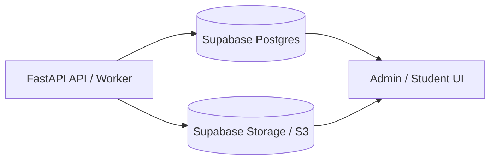

# Future Features

## OCR / Layout Provenance For Ingestion

The ingestion pipeline can currently persist the final separated question structure, but it does not yet preserve page-level OCR/layout provenance. That provenance becomes important when extraction quality depends on where text appeared on the page, not just what text was read.

### When It Matters

- **Tables, charts, and graphs:** PyMuPDF or OCR may flatten rows, columns, axes, labels, legends, and values into plain text. Provenance helps preserve the original layout and data relationships.
- **Multi-question pages:** If OCR misses or merges one question, provenance can identify the exact page or region where the failure happened.
- **Answer choice alignment:** OCR can separate labels from option text or reorder nearby choices. Layout provenance helps verify that A/B/C/D pairings stayed intact.
- **Official-source auditability:** Stored official questions should be traceable back to the exact source PDF page, crop, or region.
- **Failed-ingestion debugging:** If a question disappears, provenance can show whether OCR omitted it, the extractor skipped it, or validation rejected it.
- **Selective reprocessing:** The backend could rerun only failed pages, crops, or layout blocks instead of reprocessing an entire PDF.
- **Human review UI:** Admin reviewers could compare the source crop beside the extracted question and approve or correct the result faster.
- **OCR benchmarking:** Benchmarks could show which OCR model failed on which page, table, or region instead of only reporting final question counts.

### Backend Value

This is not required for basic text-layer PDFs, but it is valuable for reliable ingestion of real SAT PDFs with scanned pages, dense layouts, tables, charts, graphs, or figures. The forced GLM-OCR benchmark that missed Question 11 is a concrete example: without provenance, the backend only knows that a question is missing; with provenance, it could identify the failed page/region and trigger targeted reprocessing.

### Proposed Data To Preserve

- source PDF path / asset ID
- page number
- rendered page image path
- optional crop image path
- extraction method per page or region: `pymupdf`, `glm_ocr`, `vlm_layout`, etc.
- diagnostic reason for visual processing
- raw PyMuPDF text
- OCR text
- structured table blocks when available
- chart/graph descriptions when available
- question-number range detected on the page
- confidence or validation warnings

### Future Implementation Direction

1. Add page diagnostics after PyMuPDF parsing.
2. Detect layout-sensitive pages using text density, table-like patterns, embedded images, and prompt cues such as "table," "graph," "chart," or "figure."
3. Render only flagged pages or crops.
4. Run GLM-OCR for text/table-heavy regions and a layout-aware VLM for charts/graphs.
5. Store provenance in job JSON and, if needed, a dedicated database table.
6. Surface provenance and source crops in the admin review workflow.

## Supabase-Centered Ingestion Persistence

The backend should treat FastAPI as a stateless API/worker layer. Anything that must be recalled later should be stored durably in Supabase/Postgres or object storage, not in FastAPI process memory.

### Durable State

Structured ingestion state should live in a single Postgres database, which can be Supabase Postgres:

- `question_assets`
- `question_jobs`
- `questions`
- `question_versions`
- `question_options`
- `question_annotations`
- future OCR/layout provenance tables
- future structured table/chart stimulus tables

Raw files and binary artifacts should live in object storage:

- source PDFs
- rendered page images
- page crops
- chart/table crops
- image assets needed for later review or UI rendering

For production, this should be Supabase Storage or S3-compatible storage rather than local disk.

### FastAPI Runtime State

FastAPI should only hold temporary runtime state while a request or background job is actively executing:

- in-progress OCR calls
- in-progress LLM calls
- temporary parsed text
- temporary page/crop files before upload to object storage

No question, source asset, OCR output, chart/table data, or provenance needed for later recall should depend on FastAPI memory.

### Target Architecture

Supabase Postgres should store the structured metadata and relational links. Object storage should store PDFs, rendered pages, crops, and other binary artifacts. The database should store object-storage paths so any UI can reconstruct the source context for a question.
