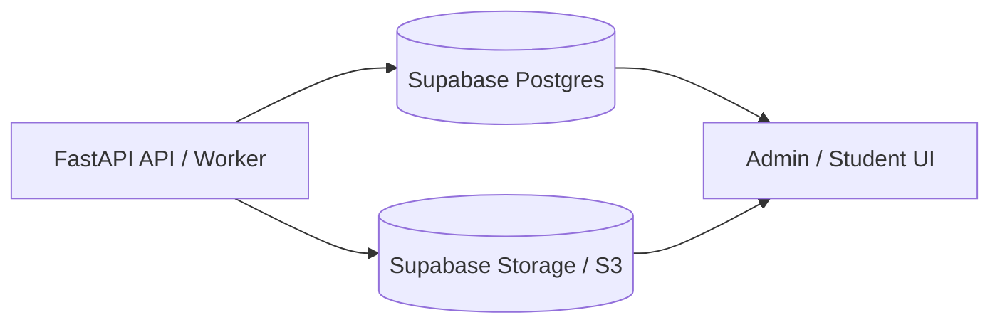

# Future Features

## OCR / Layout Provenance For Ingestion

The ingestion pipeline can currently persist the final separated question structure, but it does not yet preserve page-level OCR/layout provenance. That provenance becomes important when extraction quality depends on where text appeared on the page, not just what text was read.

### When It Matters

- **Tables, charts, and graphs:** PyMuPDF or OCR may flatten rows, columns, axes, labels, legends, and values into plain text. Provenance helps preserve the original layout and data relationships.
- **Multi-question pages:** If OCR misses or merges one question, provenance can identify the exact page or region where the failure happened.
- **Answer choice alignment:** OCR can separate labels from option text or reorder nearby choices. Layout provenance helps verify that A/B/C/D pairings stayed intact.
- **Official-source auditability:** Stored official questions should be traceable back to the exact source PDF page, crop, or region.
- **Failed-ingestion debugging:** If a question disappears, provenance can show whether OCR omitted it, the extractor skipped it, or validation rejected it.
- **Selective reprocessing:** The backend could rerun only failed pages, crops, or layout blocks instead of reprocessing an entire PDF.
- **Human review UI:** Admin reviewers could compare the source crop beside the extracted question and approve or correct the result faster.
- **OCR benchmarking:** Benchmarks could show which OCR model failed on which page, table, or region instead of only reporting final question counts.

### Backend Value

This is not required for basic text-layer PDFs, but it is valuable for reliable ingestion of real SAT PDFs with scanned pages, dense layouts, tables, charts, graphs, or figures. The forced GLM-OCR benchmark that missed Question 11 is a concrete example: without provenance, the backend only knows that a question is missing; with provenance, it could identify the failed page/region and trigger targeted reprocessing.

### Proposed Data To Preserve

- source PDF path / asset ID
- page number
- rendered page image path
- optional crop image path
- extraction method per page or region: `pymupdf`, `glm_ocr`, `vlm_layout`, etc.
- diagnostic reason for visual processing
- raw PyMuPDF text
- OCR text
- structured table blocks when available
- chart/graph descriptions when available
- question-number range detected on the page
- confidence or validation warnings

### Future Implementation Direction

1. Add page diagnostics after PyMuPDF parsing.
2. Detect layout-sensitive pages using text density, table-like patterns, embedded images, and prompt cues such as "table," "graph," "chart," or "figure."
3. Render only flagged pages or crops.
4. Run GLM-OCR for text/table-heavy regions and a layout-aware VLM for charts/graphs.
5. Store provenance in job JSON and, if needed, a dedicated database table.
6. Surface provenance and source crops in the admin review workflow.

## Pass 2 (Annotation) Efficiency Optimization

The ingestion pipeline's Pass 2 annotation step is the dominant runtime cost of a
job. A 27-question module took ~22 minutes in observed runs, almost entirely in
this phase. The work below would cut wall-clock time substantially with low risk,
and optionally reduce token cost with a larger refactor.

### Measured Cost

A 27–33 question module triggers **one sequential LLM call per question**. Each
call carries a system prompt that is ~99% a static rules reference:

- **~10,300 input tokens** for grammar-domain questions (`_grammar_context()`)
- **~17,500 input tokens** for reading-domain questions (`_reading_context()`)

That system prompt is **byte-identical for every question of the same domain** —
only the small user message (the per-question JSON) varies. A single module
therefore re-sends roughly 300–470K tokens of unchanging rules text, one
question at a time, fully serialized.

Relevant code: `backend/app/routers/ingest.py` per-question loop at the Pass 2
section (`for i, q_data in enumerate(questions_data)`), and
`backend/app/prompts/annotate_prompt.py` (`build_annotate_prompt`,
`_grammar_context`, `_reading_context`).

### Optimization Levers (ranked)

**1. Parallelize the annotation calls — biggest wall-clock win.**
The loop currently `await`s `provider.complete(...)` one question at a time.
Gather the LLM calls with a bounded semaphore (4–6 concurrent), then run
validate/persist sequentially afterward (persistence must stay serial because of
the per-question DB savepoints). Expected: ~22 min → ~4–6 min. No token-cost
change. Risk: concurrent load on the `qwen3-vl:235b-instruct-cloud` endpoint —
confirm it tolerates parallel requests / rate limits first. Moderate refactor:
split the loop into a parallel "annotate all" phase producing a list, then a
serial "validate + persist" phase.

**2. Sort questions by domain so identical prompts run consecutively — cheap.**
Ollama reuses a cached KV prefix across requests when the model stays loaded and
the prompt prefix is identical. Grammar and reading questions are currently
interleaved, so the 10K/17.5K-token prefix is repeatedly evicted. Sorting
`questions_data` by detected domain before the loop lets the prefix cache hit.
~10-line change, low risk, a real latency win even without parallelizing.

**3. Batch annotation — biggest token/cost win, highest risk.**
Annotate K questions per LLM call so one rules prompt is amortized over K
questions (K=5 → ~5× fewer rules-token resends). Risk: large output JSON, parse
fragility, harder per-question retry, possible quality dilution. Should be a
separate, carefully tested change.

**4. `lru_cache` the rules-file reads — trivial cleanup.**
`_grammar_context()` / `_reading_context()` re-read the ~20K-token rules
markdown files from disk on every question. Cache them with `functools.lru_cache`.
Tiny win (disk I/O, not LLM time), but free — worth doing alongside #1.

### Recommended Bundle

Implement **#1 + #2 + #4 together** as one commit: ~4–6 min wall-clock instead
of ~22 min, with no quality risk and no change to output format. Capture a
before/after timing baseline on the same module. Treat **#3 (batching)** as a
separate follow-up where the token-cost savings live.

### Provider Choice: Would Claude or OpenAI Help?

Yes — meaningfully — primarily through one mechanism the current setup cannot
fully exploit: **prompt caching**. Phase 2's core inefficiency is re-sending an
identical 10–17.5K-token rules block on every call. Hosted providers cache it:

| Provider | Caching behavior | Effect on Phase 2 |
|---|---|---|
| **Anthropic (Claude)** | Explicit `cache_control` breakpoints; ~90% cost cut on cache reads + faster time-to-first-token | First call per domain writes the cache; all remaining same-domain calls hit it. Biggest win. |
| **OpenAI** | Automatic for >1024-token identical prefixes; ~50% discount + latency gain | Free, zero code, but smaller discount and less control. |
| **Ollama `qwen3-vl:235b-instruct-cloud` (current)** | Only opportunistic KV-prefix reuse if the model stays loaded and prompts run back-to-back — fragile, not guaranteed | Why lever #2 (domain-sorting) is needed just to *maybe* get caching. |

Claude turns the unreliable lever #2 into a guaranteed ~90% reduction on the
repeated rules tokens — the single largest efficiency gain available.

**Other advantages of a hosted provider:**

- **Concurrency** — hosted Claude/OpenAI handle parallel requests well, so
  lever #1 (parallelize) works cleanly. The qwen cloud endpoint's concurrency
  limits are unknown and may throttle.
- **Instruction-following** — Claude is strong at structured-JSON annotation;
  it would likely also reduce the "unknown `stem_type_key`" enum-drift errors.
- **Clean to adopt** — Pass 2 annotation is **text-only** (it operates on the
  extracted question JSON, not images). Route *just Phase 2* to Claude while
  keeping the VLM (`qwen3-vl`) for Pass 1 vision extraction and OCR. Config
  already exposes `anthropic_api_key` / `openai_api_key`.

**Caveat:** Ollama cloud may be flat-rate or cheaper per raw token; Claude /
OpenAI bill per token. Prompt caching is what flips that math — the 300–470K
repeated rules tokens become ~90% cheaper on Claude, with a latency win too.
This does not replace levers #1/#3 — it stacks with them.

**Recommendation:** route Pass 2 to **Claude with explicit prompt caching** on
the rules block; keep the VLM for vision extraction and OCR.

## Supabase-Centered Ingestion Persistence

The backend should treat FastAPI as a stateless API/worker layer. Anything that must be recalled later should be stored durably in Supabase/Postgres or object storage, not in FastAPI process memory.

### Durable State

Structured ingestion state should live in a single Postgres database, which can be Supabase Postgres:

- `question_assets`
- `question_jobs`
- `questions`
- `question_versions`
- `question_options`
- `question_annotations`
- future OCR/layout provenance tables
- future structured table/chart stimulus tables

Raw files and binary artifacts should live in object storage:

- source PDFs
- rendered page images
- page crops
- chart/table crops
- image assets needed for later review or UI rendering

For production, this should be Supabase Storage or S3-compatible storage rather than local disk.

### FastAPI Runtime State

FastAPI should only hold temporary runtime state while a request or background job is actively executing:

- in-progress OCR calls
- in-progress LLM calls
- temporary parsed text
- temporary page/crop files before upload to object storage

No question, source asset, OCR output, chart/table data, or provenance needed for later recall should depend on FastAPI memory.

### Target Architecture

Supabase Postgres should store the structured metadata and relational links. Object storage should store PDFs, rendered pages, crops, and other binary artifacts. The database should store object-storage paths so any UI can reconstruct the source context for a question.
