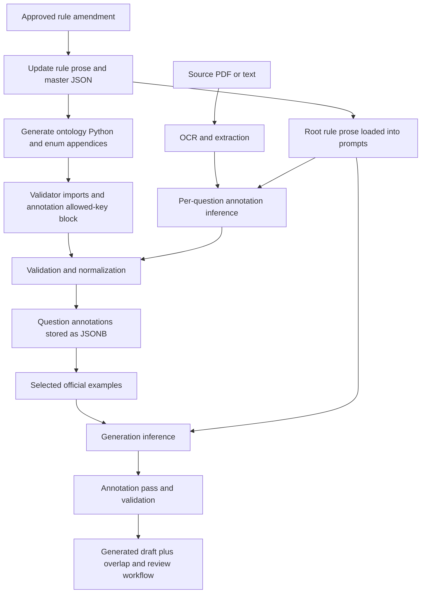

# ADR: Extend the existing rules refactor with versioned context bundles

**Status:** Refreshed against RULES_REFACTOR_v3 on 2026-09-06; incremental adoption in progress.
**Date:** 2026-09-06 UTC.
**Decision owner:** Project maintainer.
**Related design:** [CANONCIAL_VOCABULARIES_CGPT.md](CANONCIAL_VOCABULARIES_CGPT.md).

## Decision

Continue `rules_refactor/`; do not start another independent rules rewrite. Its deterministic decomposition is a useful foundation. Add a coordinated adoption phase covering prompt loading, ontology alignment, versioned artifacts, stage-specific context, cache telemetry, and generation checkpoints.

Distinguish three kinds of work:

1. **Packaging:** the existing refactor already splits rules into modules.
2. **Semantics:** the CGPT ontology proposal adds clearer concepts, evidence relationships, grammar errors, and style dimensions. Most of that remains proposed.
3. **Execution:** the current backend still loads root monoliths and does not use the refactor manifest in the inspected paths. This is the immediate adoption gap.

The original review was documentation-only. This refresh starts a generation-only, opt-in manifest loader using `rules_refactor/rules/`. Annotation, review, ontology migration, release pinning, and provider changes remain separate work. Findings describe checked-out code, not a live deployed-service test.

## 1. Verified progress toward the ontology proposal

| Proposal area | Existing progress | Remaining work |
|---|---|---|
| Select rules by skill | Manifest contains 44 grammar focus entries and seven reading families | Wire loaders to the manifest; normalize focus-to-family routing |
| Separate ingestion and generation | Each manifest entry has `annotate` and `generate` lists | Shared skill files still contain generation recipes/distractor tables during annotation; refine by stage |
| Separate style | `reading/style_fingerprint.md` is generation-only | Convert broad prescriptions into defined style features and calibrated profiles |
| Preserve dependencies | Delimiter-sensitive grammar skills include cross-key guidance; conditional transition/synthesis modules exist | Add declarative dependency validation, review load sets, and explicit fail-closed behavior |
| Exclude bulky enum appendices | Splitter deliberately excludes generated Appendix V | Supply compact applicable enum subsets; validators alone cannot teach an LLM the legal strings |
| Correct vocabulary drift | Corrected copies fix several invalid values, references, and classifications | Reconcile with current root documents and current vocabulary; do not overwrite newer changes blindly |
| Sentence anatomy | `future_anatomy.md` is emitted but not loaded | Correct definitions and reconcile with the backend's existing span service before adopting |
| Fine-grained grammar errors | Per-focus distractor prose exists | Machine-readable error hierarchy, evidence links, and misconception separation remain absent |
| Multi-trap and uncertainty semantics | Existing shape mostly preserved | New contract and migration required; do not silently change old null/none/multiple semantics |
| Stem and synthesis decomposition | Separate transition/synthesis files help retrieval | Current flat key model remains; implement compositional fields incrementally |
| Term cards and ontology relationships | No new term registry in manifest | Stable IDs, definitions, examples/counterexamples, applicability and evidence still needed |
| Versioned execution | Human-readable manifest version exists | Content hashes, schema versions, pinned releases, durable stage records, cache invalidation |

`rules_modularize/` is an older planning set referencing grammar v3/reading v1. Reuse relevant ideas from it, but use `rules_refactor/` as the current implementation base. Creating a third divergent source tree would increase drift.

## 2. Reproducibility and measured context size

I imported `split_rules.py` and redirected its output to a fresh `/tmp/dsat-rules-audit-*` directory. Results:

The verified output was subsequently moved into [rules/](rules/) beside this plan. The temporary path describes the audit's original execution location.

- 65 Markdown modules generated.
- Grammar source: 6,945 lines; reading source: 3,127 lines.
- No unassigned nonblank ranges in either coverage report.
- Every regenerated output file matched its counterpart in `rules_refactor/rules/` byte for byte.
- Every Markdown path referenced by the manifest exists.

This verifies repeatable decomposition, not correctness of every rule or completeness of runtime integration. The root and refactor monoliths differ, so a reconciliation step is necessary.

The original audit (before the label fix) measured:

| Rule context | Characters | Interpretation |
|---|---:|---|
| Current grammar route | 245,409 | Large grammar-wide selection, not focus-specific |
| Historical reading route | 0 | Superseded: label bug is now fixed |
| Historical unspecified/both route | 414,143 | Superseded: label fallthrough is fixed |
| Refactor `semicolon_use` generation load set | 59,477 | Four modules; approximately 76% fewer characters than the current grammar rule context |
| Refactor `semicolon_use` annotation load set | 48,080 | Four modules |
| Refactor `words_in_context` generation load set | 118,007 | Five modules; still substantial |
| Refactor `words_in_context` annotation load set | 57,611 | Four modules |

Counts are Unicode characters in rule strings/module contents, not model tokens. Manifest totals exclude joining separators and labels; all totals exclude runtime instructions, source examples, user payload, and output. Do not repeat the README's approximate token counts as measured current results.

Reading generation remains large because its load set includes 38,862 characters of generation core, 36,535 of core taxonomy, 26,444 of style guidance, plus shared schema and skill content. Splitting files is only the first reduction; selecting relevant sections within their semantic responsibilities is the next.

## 3. Immediate findings in current code

### 3.1 Reading generation label bug is already fixed

Current `generate_prompt.py` consistently uses `Reading v3` in section selection and domain filtering. The cached builder loads reading context correctly. Do not reimplement the label fix. The historical zero-context measurements in §2 are superseded; rerun the real builders for the comparison baseline.

The legacy two-part builder still loads both domains by default. Preserve that default during this first increment; test both public builders when opting into modular generation.

### 3.2 Generation-only opt-in manifest integration

Both generation builders now select the baseline manifest when `DSAT_GENERATION_RULES_MODE=modules`. Default `legacy` retains the existing monolith behavior. The loader uses `rules_refactor/rules/`, never the CGPT snapshot. Annotation and review still use root documents; review has no manifest load sets.

The modular path resolves explicit grammar focus, reading family/focus (including the existing family alias), and the notes-synthesis stem override. It preserves conditional modules and ordered deduplication, rejects unknown/conflicting targets and `do_not_generate` entries, and fails on missing, empty, or out-of-directory modules. It appends the existing active allowed-key renderer because modules exclude Appendix V. This is not a complete release-specific enum compiler.

### 3.3 Annotation already performs partial routing and RAM caching

`backend/app/prompts/annotate_prompt.py` caches file contents and assembled grammar/reading contexts with `lru_cache`. Reading sections are selected by inferred skill family. Grammar still loads broad Parts A/C/D, including anatomy material that the refactor deliberately excludes.

The allowed-key block is built once at import and includes both domains. `_STEM_SKILL_FAMILY` maps `choose_best_weakener` and `choose_best_illustration` to inferences; those labels can represent evidence tasks. Routing should use the actual task and supporting metadata, with ambiguity fallback, rather than trusting a stem alias alone.

### 3.4 Cache invalidation is incomplete as a release mechanism

`clear_prompt_cache()` exists, but no caller was found under `backend/app`. It clears rules-string caches, not the import-time `_ALLOWED_KEYS_BLOCK` or all modules that imported ontology constants.

Amendment promotion updates files and regenerates artifacts. That does not automatically update every running process's imported enums and cached prompts. A release needs consistent rules and validators, pinned per job. Initially, coordinated worker restart on release may be simpler than safe hot reload.

### 3.5 Current cache telemetry cannot establish realized savings

- Anthropic adapter marks the static block cacheable and returns cache creation/read counts.
- Ingestion's `_annotate_with_retry` persists ordinary token usage but does not copy `cache_token_usage` into its metadata.
- Generation pass metadata shown in `_run_generate_pipeline` stores model/provider/latency but omits ordinary and cache token counts.
- OpenAI adapter records total prompt/completion tokens but not `prompt_tokens_details.cached_tokens`.
- Review calls `complete`, not `complete_cached`. Automatic backend caching may still apply; explicit Anthropic cache blocks do not follow that path.
- Ingestion prewarms each distinct domain/variant with an extra paid model call. Its comment promises every concurrent call gets a hit; that promise is not established by telemetry.

Record attempts, including retries and warmups, before claiming savings. Cumulative call latency is not elapsed job time.

### 3.6 Provider capability mismatch deserves a focused check

`_annotate_with_retry` passes `disable_thinking=True` to `complete_cached` unconditionally. The inspected Ollama implementation accepts it; OpenAI and Anthropic signatures do not. Those adapter paths can raise an unexpected-keyword error before reaching inference. Standardize optional capabilities or conditionally pass the argument; test all adapters with the real caller signature.

This is a code-level finding, not a claim that every currently configured ingestion request is failing.

## 4. Clarifying the JSON / JSONB workflow

There is not one universal “JSONB rules file” in the inspected workflow. These artifacts have distinct jobs:

| Artifact | Meaning | How used |
|---|---|---|
| Root grammar/reading Markdown | Human-authored semantic guidance | Loaded into current prompts; patched through amendments |
| `vocabulary/master.json` | JSON file containing active/candidate/deprecated controlled values | Compiler/enforcement manifest; not a per-question annotation |
| `backend/app/models/ontology.py` | Generated Python constants | Imported by validators and annotation enum renderer |
| Generated rule Appendix V | Human-readable enum view | Derived from master; excluded by refactor splitter |
| `vocabulary/master_samples.json` | Advisory synthetic examples and labeling guidance | Header recommends selected retrieval; no backend/scripts reference found in this audit |
| `rules_refactor/rules/manifest.json` | Focus/mode-to-file load plan | Sandbox packaging, not the ontology or a database payload |
| `QuestionJob.pass1_json`, `pass2_json` | PostgreSQL JSONB pass results | Extraction/generation output, then annotation output |
| `QuestionAnnotation.annotation_jsonb` | Per-question classification and option analysis | Stored after inference and validation; reused as source-example context |
| `generation_profile_jsonb` | Per-question generation metadata | Separate from active vocabulary and intended schema |
| `explanation_jsonb`, `confidence_jsonb`, `passage_spans` | Explanations, confidence, span annotations | Question-specific outputs, not global rules |

`master.json` points to `master_samples.json`, but that pointer alone does not mean the prompt builders load the companion. The supplied canonical Markdown and the master file's note say “edit THIS file,” while the generator header and amendment pipeline describe approved amendment promotion. Standardize these instructions.

Current logical flow:



The arrows express logical dependencies, not a transactional guarantee. Current amendment code coordinates file writes with backups; this is not an atomic database-style release across running workers.

`_load_official_source_examples` in `backend/app/routers/generate.py:247` loads the full stored annotation alongside passage/stem and per-option explanations. This is another context expansion point. Introduce phase-specific projections rather than dumping all JSONB into each prompt.

Examples:

- Composition receives passage style, target rule, necessary structure, and one or two selected passage exemplars.
- Distractor design receives the completed passage, correct answer, relevant errors/traps and selected option examples.
- Annotation receives immutable question text and options, not the generator's claimed reasoning.
- Review receives the completed item, relevant rules and rubric; answer-blind solving precedes comparison with the proposed key where practical.

Cache projections by source question version and annotation version. Do not cache by question ID alone while reading mutable “latest” records.

## 5. Proposed compilation and loading workflow

Maintain one authored source set. Initially preserve the existing monolith authoring approach; publish a compiled release rather than manually editing generated modules.

```text
approved rule amendments + controlled-vocabulary changes
    → reconciled authored rule documents
    → deterministic compiler
        → ontology manifest / validator constants
        → rule modules
        → stage-specific schemas and allowed-key subsets
        → selected term/example index
        → context manifest + content hashes
    → validation and prompt snapshots
    → immutable release directory
    → worker release activation
    → each job pins one release ID
```

Do not treat natural-language prose as automatically sufficient to derive all machine semantics. Approved structured amendments and explicit metadata define the vocabulary; compilation checks their agreement with prose.

Proposed release layout:

```text
rules/releases/<release_hash>/
  release.json
  ontology.json
  manifest.json
  modules/
  schemas/
  examples_index.json
```

Keep `rules_refactor/rules/` as generated sandbox output until adoption. Do not maintain two competing production authorities.

A shared loader should accept mode/stage, domain, focus/family, stem template, and release ID. It returns ordered module IDs, rendered content, schema/enum subset, hashes, token estimate, and routing diagnostics.

Requirements:

- Stable semantic IDs, not display version labels, drive routing.
- Resolve reading focus to family; include known confusable neighbors and prerequisite rules.
- Preserve explicit conditional modules, deduplicate dependencies in order, enforce do-not-generate.
- Missing required content fails loudly; ambiguous ingestion widens to a bounded routing set rather than all documents.
- Every referenced path must stay within the release directory.
- Review must have dedicated load sets; preserve necessary grammar/style canon without loading unrelated generation procedures.
- Keep applicable enum values in the prompt/schema. Removing Appendix V does not justify omitting all legal-key guidance.
- The existing splitter's line-coverage checks remain useful, supplemented by semantic dependency and prompt-content tests.
- Source hashes, schema hashes, compiler version, and prompt template version form the release identity.

## 6. RAM, NVMe, and model caching solve different problems

| Mechanism | Recommended use | What it does not do |
|---|---|---|
| Bounded process RAM cache | Parsed release manifests, rendered bundles, allowed-key subsets | Does not reduce model context if the same text is still sent |
| NVMe artifact cache | OCR results, extracted records, versioned prompt bundles, completed stage outputs | A model cannot consult a local path unless the application retrieves content |
| Provider prompt/prefix cache | Reuse computation for an identical stable prompt prefix | Does not remove those tokens from the logical context window |
| Local inference KV reuse | Potential prefill savings for repeated prefixes on a compatible backend | Not the same as a JSON-file cache or a guaranteed cross-request cache |
| Context selection and phase-specific projection | Send only applicable rules, evidence and fields | Requires routing/dependency checks so relevant rules are not lost |

**Recommendation:** start with RAM for compiled bundles plus NVMe for durable artifacts/checkpoints. Add no new Redis/vector database solely to store a few megabytes of rules. Reconsider a shared cache only when multi-worker contention or measured scale justifies it.

For exact ontology keys, deterministic manifest lookup is preferable to approximate semantic retrieval. Search/embeddings may help choose examples or diagnose unknown constructs, but should not decide which mandatory rule disappears from context.

### Cache keys and invalidation

| Cache | Required identity inputs |
|---|---|
| Rule bundle | Release hash, stage, domain, focus set, schema/template version |
| OCR artifact | Source checksum, page/crop identity, OCR engine/model/configuration version |
| Extraction result | OCR/source hash, extraction prompt/schema, model and parameters |
| Annotation result | Exact question version and answer-source policy, rule release, model, prompt/schema, parameters |
| Example projection | Question version, annotation version, projection schema, requested phase |
| Generated stage checkpoint | Job/specification ID, upstream artifact hashes, release, model/configuration, stage version |

Use canonical serialization and a cryptographic hash. Include provider endpoint/routing identity where it affects results; keep credentials out of cache paths/logs. Mutable model aliases require a revision identifier or explicit invalidation policy.

Use atomic writes, integrity checks, bounded size/eviction, and a per-key lock to avoid duplicate work. Keep reusable caches separate from durable audit records. A corrupt cache is a miss, not new ground truth. A changed rule release invalidates annotation descendants, not unchanged OCR. A changed passage invalidates its distractors, explanations, and review.

Generated result caching should resume the **same job**, not silently return the same question for a new generation request. New requests retain diversity through new job/specification identities. Store actual parameters; a seed not supported by the resolved provider is not a reproducibility guarantee.

### Provider-specific facts and limits

OpenAI documents exact-prefix prompt caching and reports cached input via usage details. Keep stable rules first and variable question data last, and record actual `cached_tokens`. An OpenAI-compatible local endpoint does not inherit OpenAI's caching guarantees. [OpenAI prompt caching](https://developers.openai.com/api/docs/guides/prompt-caching)

Anthropic supports explicit cache control and exposes cache read/creation usage. Validate cache behavior from those counters; warmup calls and cache writes have costs. Batch by stable prefix where useful, but do not prewarm every variant without evidence of benefit. [Anthropic prompt caching](https://platform.claude.com/docs/en/build-with-claude/prompt-caching)

The Ollama adapter sends `options.num_keep` through `/v1/chat/completions`. Ollama documents only partial OpenAI compatibility, and the documented supported request fields do not establish this option's effect. Treat prefix locking as unverified on the actual endpoint/version; measure or use a supported native path if needed. `num_keep` must not be treated as permission to overflow the context budget. [Ollama OpenAI compatibility](https://docs.ollama.com/api/openai-compatibility)

Do not move KV tensors to NVMe as the first optimization. Backend-specific offloading may add transfer costs; it is separate from saving JSON artifacts. First reduce prompts, then measure prefill/decode behavior and memory on the actual inference backend. No hardware sizing or realized cache-hit claim is made here.

## 7. Ingestion: improve the existing passes

Ingestion already separates OCR/extraction from per-question annotation. Preserve that architecture.

| Stage | Context | Durable result |
|---|---|---|
| Extract | Source/page region and extraction schema | Exact source text, options, provenance, extraction uncertainty |
| Route | Compact domain/focus descriptors, stem and option differences | Candidate focus set with evidence/confidence |
| Annotate | Selected rules, applicable enums, exact item and necessary neighbors | Classification, option errors, decisive evidence |
| Validate | Programmatic contracts; targeted semantic escalation | Errors, unknowns, review requirements |
| Optional anatomy | Sentence text, selected anatomy concepts | Version-linked spans and relationships |

Routing should be deterministic when the evidence is clear. Use a small model call only for ambiguity; do not add a classifier call to every item by default. Agreement versus verb-form ambiguity may require both rule modules. The route is a candidate set, not a constraint forcing an unsupported answer.

Grammar annotation should receive grammar interpretation and option-error guidance, not bulk passage-generation recipes. An annotation pass must not “repair” source text to make its rule assignment fit. Preserve punctuation, negation, qualifiers, notes and data required to distinguish options.

Cache extraction so reannotation after an ontology change does not repeat OCR. Prefer schema-based payload projection over arbitrary truncation; if decisive source content cannot fit, route to a suitable context budget rather than silently dropping it.

## 8. Generation: staged, but not unnecessarily fragmented

Current generation already does:

```text
load specification/examples → generate complete item → annotate again
    → validate → persist draft → overlap/review workflow
```

The first prompt requests classification, option analysis, reasoning and profile as well as the actual item. The next call then annotates again. That is an opportunity to separate ownership of outputs rather than simply add more calls.

### Recommended first experiment: three model stages

| Stage | Task | Output ownership |
|---|---|---|
| G0 — programmatic | Validate request, pin release, select rule dependencies and examples | Specification and prompt bundle; no LLM required |
| G1 — compose | Build passage, target construction, stem and correct completion | Candidate item foundation; concise decisive-constraint statement |
| G2 — distractors | Produce three plausible wrong answers against the actual passage | Option set, intended error mechanisms and evidence |
| G3 — independently solve/annotate | Re-evaluate item with fresh context, check all options and explain | Observed classification, answer validation, explanations and review findings |
| G4 — programmatic/workflow | Schema checks, overlap checks, persistence and existing quality review | Draft/review state and complete provenance |

G3 should first solve without the generator's claimed answer/reasoning where feasible, then compare against them. It may still share a model with generation, so independent context is not proof of independent judgment. Preserve the existing external review path while evaluating this experiment; avoid creating overlapping full reviews accidentally.

Use conditional subdivision:

- **Simple grammar:** G1 and G2 can remain one model call; sentence and options are tightly coupled.
- **Difficult grammar traps:** separate distractor pass can concentrate on controllers, boundaries and attachment errors.
- **Reading:** compose passage before options to protect prose quality and evidence structure.
- **Synthesis:** select goal/required notes before writing the answer set; verify each fact against notes.
- **Quantitative:** validate the underlying data and rendering before data-dependent option design.

Each stage gets the current artifact plus a compact structured contract, not the entire previous conversation. Persist full traces separately for audit. Retry only the failed stage, with bounded attempts and structured errors. If a repair changes upstream text, invalidate and rerun dependent stages.

### Budgeting rule

For every call:

```text
selected rules + schemas/enums + examples + item/stage input
+ output reserve + provider-required reasoning reserve <= usable model context
```

Do not count cached tokens as free context. Measure with the actual model tokenizer or provider counting interface. Character counts above are only a diagnostic baseline.

More passes may reduce peak context and improve repair precision while increasing total tokens, latency and failure opportunities. Compare end-to-end **cost per accepted unique item**, not just prompt size per call.

## 9. Options considered

| Option | Complexity | Advantages | Disadvantages | Recommendation |
|---|---|---|---|---|
| Fresh rewrite | High | Freedom to redesign all semantics | Duplicates corrected work; creates another source tree and broad migration risk | Reject for now |
| Adopt current modules unchanged | Medium | Immediate focused loading | Large cores, no review sets, no coherent release lifecycle | Useful intermediate baseline only |
| Add cache around existing loaders | Low initially | Reuses reads/prefix work | Preserves wrong routing and unnecessary context | Insufficient by itself |
| Extend refactor with compiler/loader and phased pilot | Medium, incremental | Reuses verified modules; aligns prompts, enums and provenance | Needs dependency tests, migration decisions and telemetry | Recommended |

## 10. Implementation sequence and acceptance criteria

### A. Correctness baseline

- [x] Confirm Reading v3 label routing is already fixed.
- [x] Fail on missing required rule context in the opt-in modular path.
- [x] Test real prompt builders for grammar, reading and unresolved routes (legacy broad context; modules reject unresolved targets).
- [ ] Standardize provider optional arguments, including `disable_thinking`.
- [ ] Record full rendered prompt size, selected modules, actual route and all attempt usage.

Acceptance: every representative supported request loads intended rules; no empty rules context silently reaches generation; adapter signatures match callers.

### B. One release and one loader

First increment: opt-in generation from the existing manifest, strict routing and required-file checks, ordered dependencies, do-not-generate enforcement, and current legal-key guidance. Keep the switch off by default while root/refactor source reconciliation is pending. The untracked CGPT snapshot remains unchanged baseline material.

- [ ] Reconcile refactor copies with current root documents and active master vocabulary.
- [ ] Add manifest schema, hashes, dependency rules and explicit review load sets.
- [ ] Render stage-specific legal-key subsets from the same active release as validators.
- [ ] Integrate generation, annotation and review behind a controlled rollout switch.
- [ ] Package compiled releases in the deployment image/mount configuration.
- [ ] Pin release per job; activate with worker restart initially if needed.

Acceptance: deterministic output; all routes resolve; new jobs see new rules and matching validators; old jobs finish on their pinned release; rollback selects the previous release.

### C. Cache and payload improvements

- [ ] Cache bundles in bounded RAM and checkpoints/projections on disk.
- [ ] Add exact identities, atomic writes, invalidation, and cache-hit metrics.
- [ ] Replace full source-annotation dumps with phase-specific projections.
- [ ] Group same-prefix work where it helps, without starving other work.
- [ ] Compare cold, warm and mixed-skill batches; remove prewarming if it costs more than it saves.

Acceptance: identical inputs reuse the intended artifact; changed text/rules invalidate the right descendants; no cross-job generated duplicate is returned as fresh work; savings are measured.

### D. Grammar-first ontology and generation pilot

- [ ] Pilot agreement, finite/nonfinite verbs, clause boundaries and supplement punctuation.
- [ ] Add the CGPT proposal's definitions and option-error/evidence relationships for those concepts only.
- [ ] Compare two-pass generation+annotation against three-stage composition+distractors+annotation.
- [ ] Extend style and synthesis fields after the basic contract works.

Acceptance: reviewed items maintain unique answers, faithful classification, accurate explanations and plausible distractors on a held-out evaluation set. Report uncertainty and per-skill regressions before expanding.

## 11. Evaluation design

Run matched specifications through: (1) corrected existing loader, (2) manifest loader, (3) manifest plus measured caching, and (4) phased generation. The broken zero-rules reading path is a bug reproduction, not a fair baseline.

Keep model/backend, output limits, selected source examples and review rubric controlled. Randomize execution order where possible; separate cold-cache and warm-cache measurements. Freeze source question/annotation versions. Use human-reviewed reference items for routing and annotation accuracy and blind review of generated outputs.

Measure:

- Input/output/cache-write/cache-read tokens per attempt and per accepted item.
- Stage latency, job elapsed time, retries, peak per-call context and local memory if relevant.
- Missing-rule and invalid-key rates; ambiguous routing and fallback rates.
- Annotation agreement, decisive evidence correctness, multiple-answer rate.
- Distractor plausibility, stylistic quality, duplication/overlap and reviewer overrides.
- Cache hits by release/stage/prefix and failed invalidation cases.

Missing telemetry is unavailable, not zero. Set quality acceptance margins before evaluating; do not invent improvement percentages from the size reductions alone.

## 12. Audit boundaries

Verified: source paths, current prompt assembly, JSONB persistence definitions and usage, cache adapter code, source-example loading, manifest dependencies, reproducible splitting, and character counts.

Not verified: live service deployment, actual selected provider/model routing, provider cache hits, current database row contents, corpus frequencies, model-token counts, latency/cost improvements, or exhaustive semantic validity of all rule modules.

The recommended next work is a narrow correctness-and-loader adoption change, followed by measured cache and phased-generation experiments. A new independent refactor is unnecessary.

## 13. First adoption increment — implemented 2026-09-06

- `backend/app/prompts/rule_modules.py`: baseline generation loader, no new dependencies or ontology edits.
- Both generation builders honor `DSAT_GENERATION_RULES_MODE=legacy|modules`; invalid switch values fail explicitly.
- Compose passes the switch and mounts the original module directory read-only. No service was restarted or live generation launched.
- Local activation: set the switch in the backend process environment. Compose activation: set it to `modules` in the Compose environment and recreate the backend. Rollback: set `legacy` and recreate/restart that process. Keep files fixed for a run; this increment does not pin releases per job.
- Modular mode requires an explicit supported target; it does not silently fall back to a monolith for invalid requests.
- No bundle RAM cache was added: reading files afresh avoids stale bundles during this experimental adoption. Provider prefix behavior is unchanged.
- Annotation, review, source reconciliation, full enum subsets, immutable releases, job pinning, telemetry, and the ontology proposal remain pending. Do not enable by default before reconciliation and quality evaluation.

Verification: `cd backend` then `rtk proxy .venv/bin/python -m pytest tests/test_rule_modules.py tests/test_prompts.py -q` — 25 passed. Run from the backend directory so settings do not parse the unrelated root Compose `.env`.

Current rule-context characters (not tokens; no provider calls):

| Context | Characters |
|---|---:|
| Corrected legacy grammar | 245,409 |
| Corrected legacy reading | 144,319 |
| Corrected legacy both | 389,730 |
| Modular semicolon generation, labels and allowed-key block included | 64,810 |
| Modular words-in-context generation, labels and allowed-key block included | 123,387 |

The 65 CGPT snapshot Markdown modules and companion JSON files still match `rules_refactor/rules/` byte for byte. These remain baseline artifacts, not an implementation of the ontology proposal. Existing unrelated working-tree edits were left intact.

## 14. Shared generation quality increment — implemented 2026-09-06

Supersedes the baseline snapshot counts in §§2 and 13: the current output is
66 modules. Author rules in the corrected `rules_refactor/` monoliths, run
`rules_refactor/split_rules.py`, then refresh this directory's reference snapshot.

- Part E now emits one `shared/01_generation_quality.md` module, loaded once
  for every grammar, reading, and notes-synthesis generation route. Removed
  its accidental duplication in the future-anatomy module. Reading generation
  also loads its existing validation checklist, referenced by its protocol.
- Hard items require three plausible distractors; medium requires at least
  two. Exactly one defensible answer takes precedence. Contextual checks allow
  the grammar error being tested but reject unrelated surface flaws. Reading
  difficulty uses evidence/reasoning demands, not a syntactic-trap prerequisite.
- Every generated reading distractor explicitly requires a canonical active
  student failure mode and plausibility source. No ontology keys were added.
  Common quality gates are shared; reading retains its specific defeater rules,
  style fingerprint, canonical stems, and skill modules. Supplied official
  examples remain available through the existing prompt builders.
- Shared rules assign topic history, similarity measurement, evaluation scores,
  and factual provenance to the external workflow. The generator must report
  unavailable checks as unverified and must not invent passing scores. This
  changes the rule contract; it does not implement a new backend batch-history
  checker, similarity evaluator, or empirical calibration service.
- The common generation prompt now uses the stronger distractor requirements
  and canonical failure metadata, and allows evidence integration across
  sentences with domain-appropriate prose. These prompt changes apply in both
  modes; the new shared module remains opt-in. No services were restarted and
  the default mode remains `legacy`.
- Corrected the semicolon recipe's suggestion that a valid period is wrong
  merely because it breaks a close relationship. Choices must instead have
  concrete convention violations and cannot be defensibly co-correct.

Verification: 26 focused prompt/splitter tests passed. Regeneration reproduces
all artifacts exactly with no unassigned nonblank source lines. All supported
generation routes load the shared gate once, including combined conditional
routes; reading style and checklist dependencies are asserted. The CGPT
snapshot matches the original generated directory byte for byte.

Quality evaluation remains pending: compare matched specifications and supplied
examples using legacy versus modular rules, recording provider/rule versions,
usage, unique-answer correctness, distractor strength, and DSAT style under the
§11 evaluation design. No provider generation or claims of measured realism
improvement were made for this increment. Since common prompt wording changed,
a comparison against the pre-increment prompt must pin that earlier wording.

## 15. College Board terminology baseline — established 2026-09-06

[STANDARD.md](STANDARD.md) establishes v1.0.0 for future work. The reference
release freezes the complete active vocabulary file, the rules and source
hashes, and College Board's domain/skill/testing-point hierarchy (Framework
3.01, Table A33). Local `cb.*` identifiers are separate from current database
keys. The crosswalk preserves every existing grammar focus entry and reading
family, retaining parent-qualified identities and unresolved mappings.

The change ledger records additive reference metadata and zero production-key
renames, removals, or reparenting. It also records existing candidate-queue
collisions where official labels entered a reading-only field. Future imports
must retain source terminology and use field-scoped mappings; ambiguous labels
cannot silently become aliases. Database/history migration requires the
versioned dry-run and rollback record specified in STANDARD.md.

This is an established reference baseline, not runtime enforcement of the new
official namespace. No database migration or reannotation was applied. The
existing rule-amendment promotion workflow remains the route to active keys.
