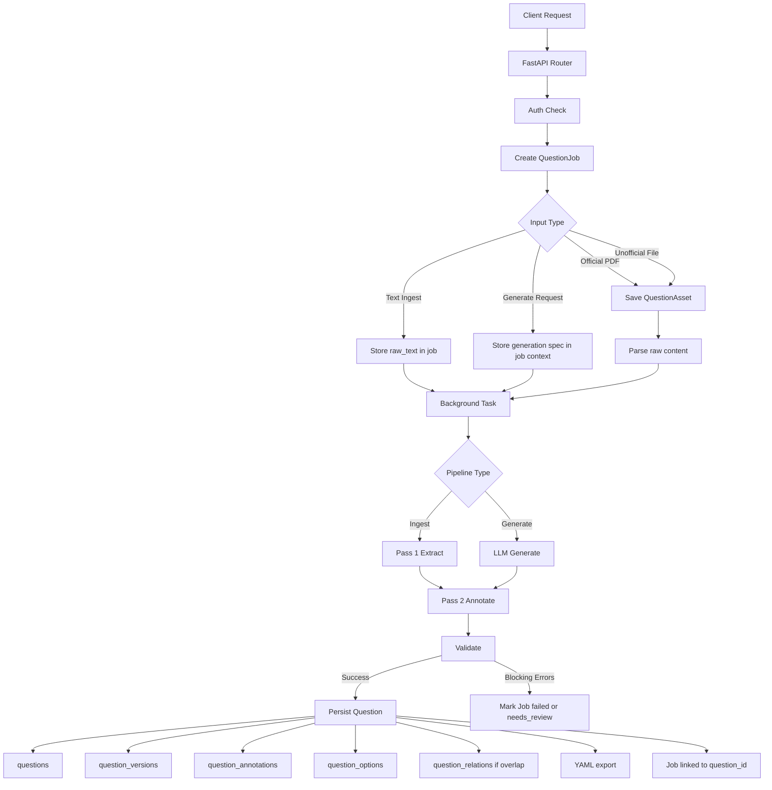

# Ingestion, Generation, and Storage Flow

This document explains the backend as it is currently implemented.

It covers:

- the ingestion process
- the generation process
- what data is persisted
- how the LLM uses the guide markdown files
- what process must run for questions and metadata to be stored
- current implementation caveats

## Summary

The backend stores three kinds of questions:

- `official` ground-truth questions
- `unofficial` questions
- `generated` questions

The storage model is centered on these tables:

- `question_jobs`
- `question_assets`
- `questions`
- `question_versions`
- `question_annotations`
- `question_options`
- `question_relations`

At a high level:

1. An API request creates a `question_job`
2. A background task runs the LLM pipeline
3. The pipeline parses input, extracts or generates question content, annotates it, validates it, and persists rows
4. The latest question state is stored in `questions`
5. Versioned content is stored in `question_versions`
6. metadata is stored in `question_annotations`, `question_options`, and job JSON fields

## Diagram

## Request Entry Points

### Ingestion

Implemented in `backend/app/routers/ingest.py`.

Main endpoints:

- `POST /ingest/official/pdf`
- `POST /ingest/unofficial/file`
- `POST /ingest/unofficial/batch`
- `POST /ingest/text`
- `POST /ingest/reannotate/{question_id}`

### Generation

Implemented in `backend/app/routers/generate.py`.

Main endpoints:

- `POST /generate/questions`
- `POST /generate/questions/compare`

## Ingestion Process

### 1. Request accepted

The router validates auth and basic request shape.

For file-based ingest:

- the raw asset is saved to local storage
- a SHA-256 checksum is computed
- a `question_assets` row is created

For text ingest:

- no asset row is required
- the raw text is written directly into `question_jobs.pass1_json`

### 2. Job row created

A `question_jobs` row is created immediately.

This row stores:

- `job_type`
- `content_origin`
- `input_format`
- `status`
- `provider_name`
- `model_name`
- `prompt_version`
- `rules_version`
- `raw_asset_id` when applicable
- `pass1_json` seed data

The API returns a `JobResponse` immediately after the job is committed.

### 3. Background task starts

The router uses `asyncio.create_task(...)` to start the real pipeline in a fresh DB session.

This means persistence only happens if the background pipeline completes successfully enough to pass validation.

### 4. Parse raw content

Depending on input type:

- PDF: text is extracted page by page using `pymupdf`
- text or markdown: decoded directly
- JSON: parsed and pretty-printed

The pipeline then works from `raw_text`.

### 5. Pass 1 extraction

For ingest, the first LLM step is extraction.

The backend builds an extraction prompt using:

- the extracted `raw_text`
- optionally source metadata hints

Expected result:

- structured question JSON
- question text
- passage text
- options
- correct option label
- source metadata
- stimulus/stem keys

The parsed JSON is stored back into `question_jobs.pass1_json`.

### 6. Pass 2 annotation

The extracted question JSON is then sent to the annotation prompt.

Expected result:

- classification metadata
- explanation metadata
- option-level analyses
- confidence/review flags
- optionally structured `generation_profile`

The parsed annotation is stored in `question_jobs.pass2_json`.

### 7. Validation

The backend validates the merged extracted + annotated data.

Current validation checks include:

- question text exists
- exactly 4 options
- correct option label is valid
- official questions include source metadata
- generated questions include lineage metadata
- ontology keys are at least review-checked against the configured ontology

### 8. Persistence

If validation does not hit blocking errors, the backend creates:

- one `questions` row
- one `question_versions` row
- one `question_annotations` row
- four `question_options` rows

If overlap detection finds official similarity for unofficial/generated items, the backend also creates:

- `question_relations` rows

### 9. YAML export

After DB persistence:

- official questions are exported into shared module YAML files
- generated and unofficial questions are exported into standalone YAML files

This export is non-fatal. If export fails, DB persistence still stands.

## Generation Process

### 1. Request accepted

The generation endpoint accepts a structured generation request.

This includes fields like:

- target grammar role/focus
- target trap
- difficulty
- optional provider/model override

### 2. Job row created

A `question_jobs` row is created with:

- `job_type = generate`
- `content_origin = generated`
- `input_format = spec`

### 3. LLM generation step

The backend builds a generation prompt from the request JSON.

The LLM returns a complete candidate question payload.

That result is stored in `question_jobs.pass1_json`.

### 4. LLM annotation step

The generated question is then sent through the same annotation stage used by ingest.

That result is stored in `question_jobs.pass2_json`.

### 5. Validation and persistence

If validation passes, the backend creates:

- a `questions` row with `content_origin = generated`
- a `question_versions` row
- a `question_annotations` row
- `question_options` rows

The generated question's source request is also stored in:

- `questions.generation_source_set`

The stored generation profile metadata is persisted in:

- `question_annotations.generation_profile_jsonb`

## What Data Is Persisted

## 1. `question_jobs`

Stores pipeline execution state and intermediate LLM data.

Persisted examples:

- job status
- provider/model used
- rules version
- raw extraction payload
- annotation payload
- validation errors
- linked `question_id`

This is the audit trail for how a question was created.

## 2. `question_assets`

Stores uploaded file metadata.

Persisted examples:

- storage path
- mime type
- exam/module provenance
- checksum
- linked `question_id` when available

## 3. `questions`

Stores the current canonical version of a question.

Persisted examples:

- `id`
- `content_origin`
- source metadata
- current question text
- current passage text
- current correct option label
- current explanation text
- `practice_status`
- overlap status
- generation lineage in `generation_source_set`

This is the main table used for recall.

## 4. `question_versions`

Stores versioned snapshots of question content.

Persisted examples:

- version number
- question text
- passage text
- options JSON
- correct option label
- explanation text
- change source

## 5. `question_annotations`

Stores metadata created by the LLM annotation step.

Persisted examples:

- `annotation_jsonb`
- `explanation_jsonb`
- `generation_profile_jsonb`
- `confidence_jsonb`
- provider/model/prompt/rules attribution

This is where most of the structured metadata lives.

## 6. `question_options`

Stores per-option analyses in structured columns.

Persisted examples:

- option label
- option text
- correctness
- distractor type
- why plausible
- why wrong
- precision score
- failure mode
- distractor distance

## 7. `question_relations`

Stores overlap and lineage relations.

Persisted examples:

- overlaps with official question
- near duplicate
- derived/adapted relationships

## How the LLM Uses the Guide Markdown Files

## Current implementation

The backend uses the rules markdown files in two different ways.

### 1. Annotation prompt loads rule text directly

`backend/app/prompts/annotate_prompt.py` reads the rules markdown file from disk and injects its contents into the system prompt.

Current behavior:

- it loads `rules_agent_dsat_grammar_ingestion_generation_v3.md`
- if the file is long, it truncates to the first 8000 characters
- that rules text becomes part of the annotation system prompt

So the annotation LLM explicitly sees part of the guide markdown at runtime.

### 2. Generation prompt references the rules file by name, but does not load the file text

`backend/app/prompts/generate_prompt.py` tells the model it is operating under the grammar rules specification, but it does not read the markdown file from disk and inject it.

So the current generation stage relies on:

- the prompt instructions
- the generation request JSON
- the model's response format discipline

It does not currently inline the full rules markdown the way annotation does.

### 3. Extraction prompt does not use the rules file

`backend/app/prompts/extract_prompt.py` is schema-driven. It tells the model how to extract question structure from raw text, but it does not load the taxonomy rules markdown.

## Practical meaning

Today:

- extraction uses a fixed schema prompt
- annotation uses the markdown rules file directly
- generation references the rules spec conceptually, but does not inject the full rules file text

## What Process Must Run For Questions To Be Generated and Stored

For a question and its metadata to be stored, all of the following must happen:

1. A request hits an ingest or generate endpoint
2. The endpoint creates and commits a `question_jobs` row
3. The background pipeline starts
4. The pipeline successfully calls the LLM for the needed step or steps
5. The backend can parse JSON from the LLM output
6. Validation must not produce blocking errors
7. The DB persistence step must commit successfully

If any of those fail, you may still have:

- a `question_jobs` row
- possibly a `question_assets` row

But you will not get:

- `questions`
- `question_versions`
- `question_annotations`
- `question_options`

## Per Content Origin

### Generated questions

Required process:

1. `/generate/questions`
2. create `question_job`
3. LLM generate
4. LLM annotate
5. validate
6. persist question + metadata

Stored source/model lineage:

- `question_jobs.provider_name`
- `question_jobs.model_name`
- `question_annotations.provider_name`
- `question_annotations.model_name`
- `questions.generation_source_set`
- `question_annotations.generation_profile_jsonb`

### Official ground-truth questions

Required process:

1. `/ingest/official/pdf` or `/ingest/text` with `content_origin=official`
2. create asset row if file-based
3. create job row
4. parse
5. extract
6. annotate
7. validate with official metadata requirements
8. persist question + metadata

### Unofficial questions

Required process:

1. `/ingest/unofficial/file`, `/ingest/unofficial/batch`, or `/ingest/text` with `content_origin=unofficial`
2. create asset row if file-based
3. create job row
4. parse
5. extract
6. annotate
7. overlap check
8. validate
9. persist question + metadata

## Current Caveats

### 1. Annotation rule loading still points at the older v3 guide

The runtime annotation prompt currently loads `rules_agent_dsat_grammar_ingestion_generation_v3.md`.

It does not yet load:

- `rules_agent_dsat_grammar_ingestion_generetion_v7.md`
- `rules_agent_dsat_reading_v2.md`

So the backend persistence model can store metadata, but the current annotation prompt is not yet using those newer guide files at runtime.

### 2. Generation prompt does not inline the guide markdown text

Generation names the rules spec, but does not inject the file contents into the prompt.

### 3. Background tasks are in-process

The pipeline runs via `asyncio.create_task(...)`.

That means:

- jobs are asynchronous
- API responses return before persistence finishes
- a process restart can interrupt in-flight work

### 4. Some rich extract fields are not promoted to dedicated columns

Some fields may exist in job JSON or annotation JSON even if they are not first-class columns on `questions`.

That is acceptable for metadata storage, but it matters if you want those fields to be queryable without JSON access.

## Minimal End-to-End Storage Checklist

If the goal is simply "store the question and its metadata", the current working path is:

1. configure DB and LLM provider keys
2. call ingest or generate endpoint
3. wait for `question_jobs.status` to become terminal
4. confirm `question_jobs.question_id` is populated
5. read:
   - `questions`
   - `question_versions`
   - `question_annotations`
   - `question_options`

If `question_id` is set on the job, the question was successfully persisted.

## Recommended Next Improvements

If you want the implementation to better match the newer guide files:

- switch annotation prompt loading from v3 to the newer rule files
- add reading-specific ontology and validation
- inline the rules markdown into generation prompts, not just annotation prompts
- optionally expose more JSON metadata in the recall/detail APIs
