# Ingestion Architecture - Canonical Current-State Ground Truth

> **Status:** Canonical architecture reference for the currently implemented
> ingestion system.
>
> **Verified:** 2026-06-08 against commit `fe1b64c` plus the working-tree
> ingestion changes present on that date.
>
> **Authority rule:** When this document and code disagree, code is authoritative.
> Update this document in the same change that alters ingestion architecture.
>
> **Scope rule:** This document describes current behavior only. Proposed
> architecture and refactor work belongs in `BACKEND_REFACTOR.md`,
> `TASKS_INGESTION_REFACTOR.md`, or another explicitly non-canonical plan.

## How Agents Must Use This Document

Read this document before changing:

- ingestion HTTP routes or accepted input formats;
- OCR strategy selection, page processing, or fallback order;
- extraction, normalization, annotation, validation, or persistence ordering;
- job statuses, terminal behavior, timeout handling, or recovery;
- `pass1_json`, `pass2_json`, or validation-error shapes;
- database rows or object-store artifacts written by ingestion.

After an architecture-changing edit:

1. Re-read the affected code path.
2. Update every affected diagram and contract table here.
3. Keep planned or desired behavior out of this document.
4. Run the ingestion tests and a documentation diff check.

## Architecture Summary

The ingestion system is an in-process asynchronous pipeline owned primarily by
`backend/app/routers/ingest.py`.

An authenticated request performs synchronous intake work, creates durable
database rows, commits them, schedules a background task, and immediately
returns a job ID. The background task acquires source text, optionally runs OCR,
extracts question structure, annotates questions concurrently, validates and
persists questions serially, and writes a terminal job status.

PostgreSQL is authoritative for job and question state. Object storage contains
supporting source, OCR, layout, crop, and diagnostic artifacts. YAML exports are
non-authoritative convenience snapshots.

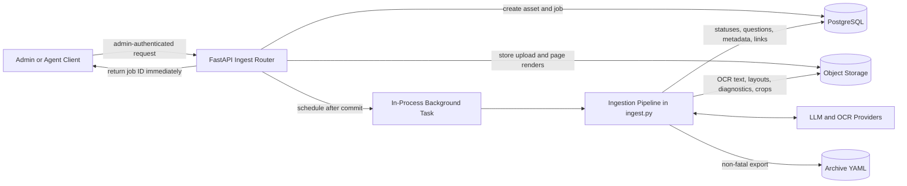

## Current Ownership Map

| Concern | Current owner | Notes |
|---|---|---|
| HTTP intake and pipeline coordination | `backend/app/routers/ingest.py` | This file owns most ingestion behavior. |
| Job concurrency cap | `backend/app/job_limits.py` | Bounds active background jobs. |
| Job transition model | `backend/app/pipeline/orchestrator.py` | Defined, but direct status assignments remain common. |
| PDF text and page rendering | `backend/app/parsers/pdf_parser.py` | Uses PyMuPDF. |
| DeepSeek OCR client | `backend/app/parsers/ocr.py` | Local HTTP OCR adapter. |
| LLM providers | `backend/app/llm/` | Cached provider instances; closed at app shutdown. |
| Extraction and annotation prompts | `backend/app/prompts/` | Pass 1 extraction and Pass 2 annotation. |
| Validation | `backend/app/pipeline/validator.py` | Structural and ontology validation. |
| Overlap detection | `backend/app/pipeline/overlap.py` | Runs for unofficial/generated content. |
| Layout detection and crops | `backend/app/storage/crop_detector.py` | Non-blocking enrichment. |
| Object storage | `backend/app/storage/object_store.py` | Current active implementation is local filesystem. |
| Durable relational state | `backend/app/models/db.py` | SQLAlchemy models backed by PostgreSQL. |

## 1. Public Ingestion Surface

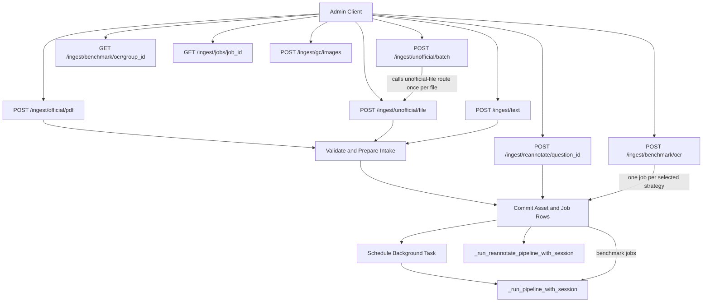

### Entry-Point Contracts

| Entry point | Synchronous intake | Background behavior | Durable response evidence |
|---|---|---|---|
| `POST /ingest/official/pdf` | Requires official source identity, validates PDF, checks duplicate checksum against prior jobs, stores raw PDF and all page renders, creates `QuestionAsset` and `QuestionJob`. Duplicate checksums are rejected when a prior job is active or already complete; failed or partial terminal prior jobs may be retried. | Runs normal ingestion pipeline. | Asset row plus ingest job in `parsing`. |
| `POST /ingest/unofficial/file` | Validates file, rejects duplicate checksum, stores raw file, parses supported format, creates asset and job. | Runs normal ingestion pipeline. | Asset row plus ingest job in `parsing`. |
| `POST /ingest/unofficial/batch` | Iterates files and calls `ingest_unofficial_file()` directly for each one. | Each accepted file schedules its own pipeline. | One response/job per accepted file. |
| `POST /ingest/text` | Validates origin and text length, creates a job without an asset row. | Runs normal ingestion pipeline. | Ingest job in `parsing`. |
| `POST /ingest/reannotate/{question_id}` | Loads current question/version, synthesizes one-question `pass1_json`, creates reannotate job. | Runs separate reannotation pipeline; skips extraction. | Reannotate job in `annotating`. |
| `POST /ingest/benchmark/ocr` | Stores one source asset and creates one ingest job per selected OCR strategy under a comparison group. | Runs normal ingestion pipeline for each strategy. | Comparison group ID and job IDs. |
| `GET /ingest/jobs/{job_id}` | Reads one persisted job. | None. | Status, first question ID, validation errors, OCR and LLM metadata. |

### Intake Sequence

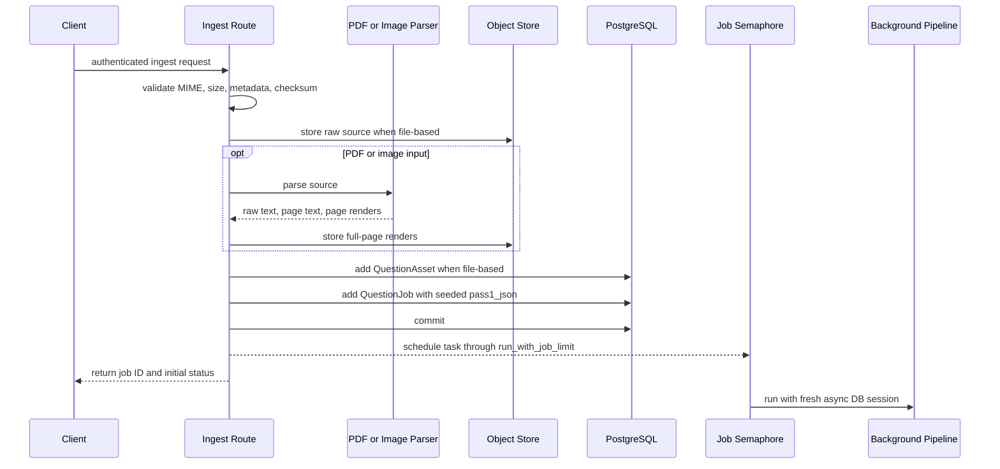

## 2. Seeded Job Data

Before the background pipeline starts, `QuestionJob.pass1_json` acts as an
internal, untyped handoff envelope.

Common seed keys:

| Key | Meaning |
|---|---|
| `raw_text` | Embedded PDF text, decoded file text, JSON text, or pasted text. File paths may store only the first 100,000 characters. |
| `_truncated` | Indicates the intake text exceeded the stored preview length. |
| `_page_images` | Stored page-render descriptors used by OCR/layout processing. |
| `_page_texts` | Per-page embedded text used to detect mixed PDFs. |
| `_ocr_strategy` | Requested OCR strategy or `null`. |
| `source_metadata` | Form-submitted source identity and page count. |

The pipeline later replaces or extends this envelope with extracted question
data, provider metadata, OCR metadata, diagnostic paths, and created question
IDs.

## 3. Source Acquisition and OCR Decision Flow

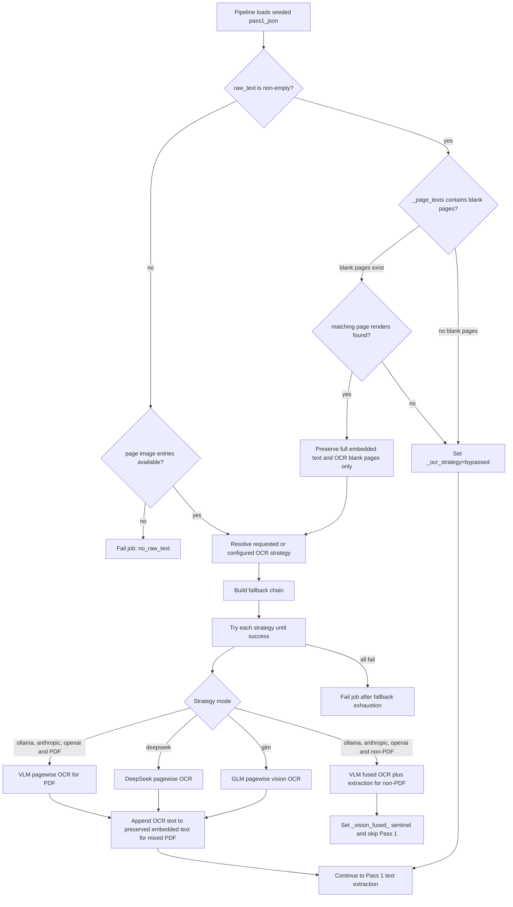

### OCR Strategy Contract

| Strategy | Adapter | PDF behavior | Non-PDF image behavior | On success |
|---|---|---|---|---|
| `glm` | Temporary `OllamaProvider` using `glm_ocr_model` | One vision request per page, bounded concurrency, sequential retry for blank pages. | Same pagewise helper over available image entries. | Produces raw OCR text; Pass 1 still runs. |
| `deepseek` | Cached `DeepSeekOCRClient` | One OCR request per page, bounded concurrency, sequential retry for blank pages. | Same helper over available image entries. | Produces raw OCR text; Pass 1 still runs. |
| `ollama` | Cached LLM provider | Pagewise OCR, then text Pass 1. | Fused vision extraction with up to three JSON-parse attempts. | PDF produces raw text; non-PDF may populate extraction directly. |
| `anthropic` | Cached LLM provider | Pagewise OCR, then text Pass 1. | Fused vision extraction. | Same mode distinction as Ollama. |
| `openai` | Cached LLM provider | Pagewise OCR, then text Pass 1. | Fused vision extraction. | Same mode distinction as Ollama. |

### OCR Fallback Order

The resolved strategy is attempted first. When `ocr_fallback` is enabled, the
remaining configured strategies follow in this preference order:

```text
glm -> deepseek -> anthropic -> openai -> ollama
```

The chain is configuration-dependent. A strategy is omitted when its required
model, key, or endpoint is unavailable.

### OCR Side Effects

Successful OCR can write:

- `pass1_json.raw_text`;
- `pass1_json._ocr_meta`;
- one `ocr_text` object-store artifact;
- per-page latency, character count, and token usage;
- later, one `ocr_diagnostics` artifact.

OCR failure is blocking. Layout detection failure is not.

## 4. Main Pipeline Flow

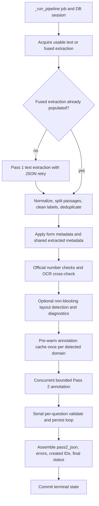

### Complete Pipeline Sequence

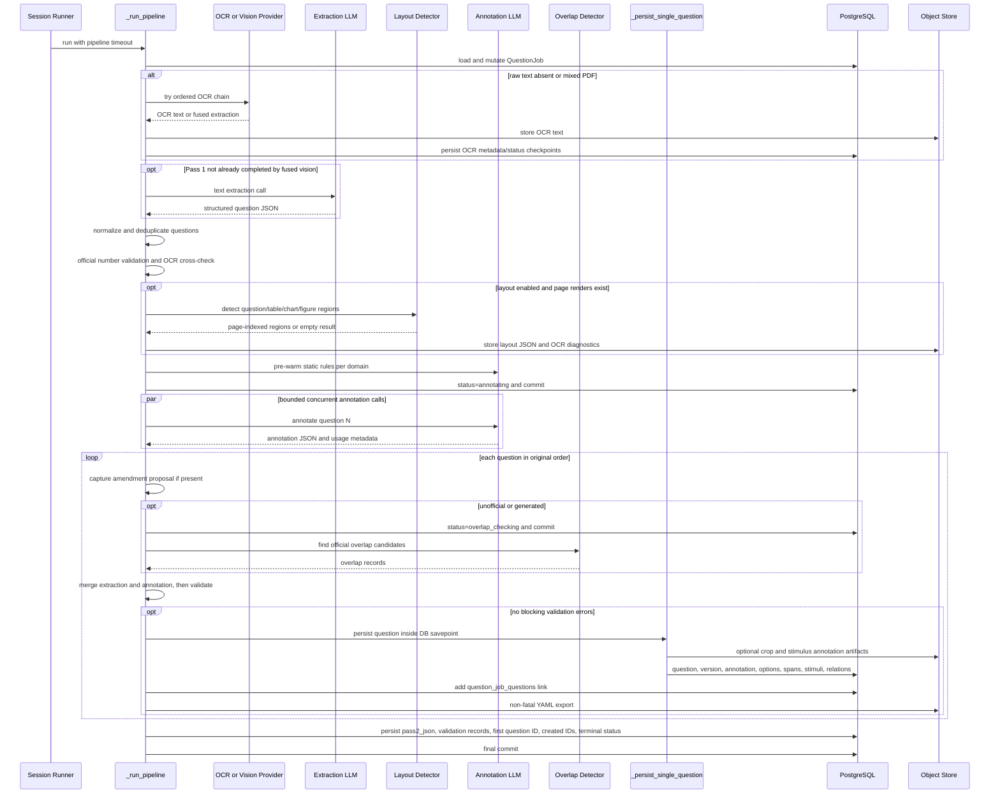

## 5. Normalization, Validation, and Annotation

### Pass 1 Extraction

Pass 1 converts usable raw text into one question object or a `questions` array.
It retries JSON/structural failures up to three attempts with backoff. Parsed
JSON that contains no non-empty `question_text` is treated as a retryable
failure. For official jobs with known subject/module counts, parsed extractions
that return too few questions are also retried before annotation; retry prompts
include the missing printed question numbers inferred from the expected module
range. If the final attempt is still short, the pipeline continues with the
partial extraction and the module-completeness safety net routes the job to
`needs_review`.

Pass 1 stores:

- the extracted root payload;
- source metadata;
- raw text;
- preserved page-image and OCR-artifact descriptors;
- `_llm_meta`;
- preserved `_ocr_meta`, when present.

### Normalization

`_normalize_extracted_questions()`:

- supports single-question and multi-question response shapes;
- merges shared source metadata into each question;
- cleans answer labels and options;
- splits passage text accidentally embedded in question text;
- attempts passage recovery from raw text;
- removes empty and duplicate questions;
- returns normalization issues instead of silently dropping them.

### Official Number Validation

For official ingestion only:

- question numbers are checked for null/non-integer values;
- subject/module expected ranges are checked;
- duplicates and gaps are reported;
- numbers are cross-checked against OCR/raw text when available.
- final extracted and created question counts are checked against the expected
  official module count when subject/module metadata is known.

Any pre-persist warning currently sets `defer_activation=True` for the entire
job, causing persisted questions to remain drafts and the job to end in
`needs_review`.

### Pass 2 Annotation

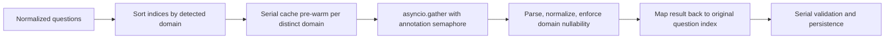

Annotation calls are concurrent but bounded by
`settings.annotation_max_concurrent`. Validation and persistence remain serial.

## 6. Per-Question Processing and Persistence

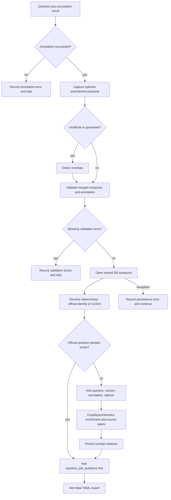

### Persistence Contract

| Behavior | Current implementation |
|---|---|
| Transaction isolation | Each question is persisted inside `db.begin_nested()` so one question can fail without rolling back successful siblings. |
| Official identity | Complete, non-suspect official identity produces deterministic UUID5. Existing official identity returns the existing question ID. |
| Primary job question | `question_jobs.question_id` points to the first successfully linked question. |
| Complete job links | `question_job_questions` links the job to every successfully produced or reused question ID. |
| Activation | Official questions are usually drafts unless testing auto-activation is enabled. Any job-level warning defers activation. Unofficial questions default active. |
| External I/O | Layout crops, stimulus annotation, object-store writes, and YAML export currently occur within or adjacent to persistence processing. |
| Export failure | Logged and non-fatal. |

## 7. Durable Database Model

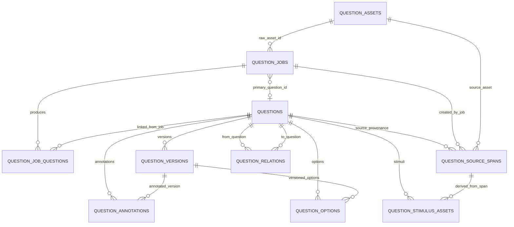

### Database Authority

| Table | Ingestion responsibility |
|---|---|
| `question_jobs` | Pipeline state, intermediate JSON, validation records, provider/model attribution, first question ID. |
| `question_assets` | Uploaded source identity, checksum, MIME type, source metadata, raw object-storage path. |
| `question_job_questions` | Complete set of questions produced or reused by one job. |
| `questions` | Current question state and source identity. |
| `question_versions` | Versioned content snapshot. |
| `question_annotations` | Pass 2 annotation, explanations, confidence, generation profile, rules attribution. |
| `question_options` | Version-scoped options and option-level analysis. |
| `question_source_spans` | Page/crop/OCR/layout provenance. |
| `question_stimulus_assets` | Stored visual/structured stimulus artifacts. |
| `question_relations` | Overlap and lineage relationships. |

## 8. Object-Store and Export Artifacts

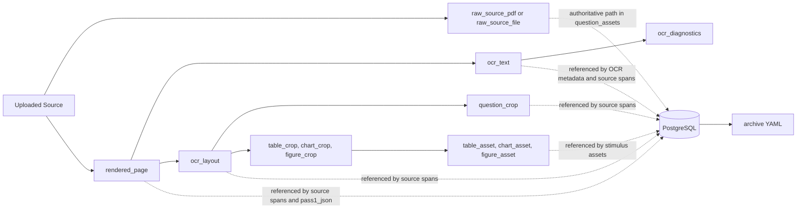

PostgreSQL is authoritative for whether a question was persisted. Object-store
artifacts support provenance and debugging. YAML export is not authoritative and
does not control job success.

## 9. Persisted Job Status Behavior

### Defined State Model

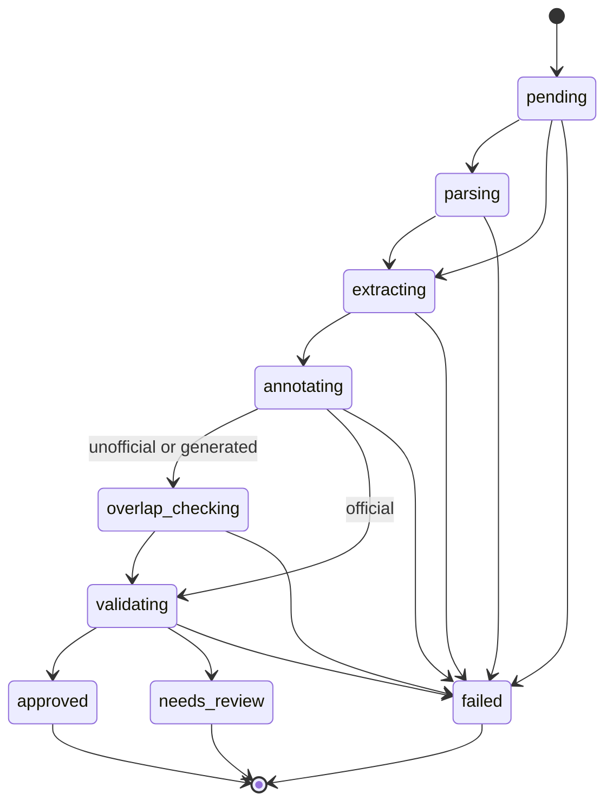

### Current Implementation Reality

- Intake-created ingest jobs begin at `parsing`.
- The pipeline directly assigns and commits statuses at several checkpoints.
- `JobOrchestrator` is instantiated and used for some OCR/extraction transitions
  and error construction, but it does not currently own all persisted status
  changes.
- During multi-question unofficial processing, `overlap_checking` and
  `validating` may be committed repeatedly.
- Terminal status is:
  - `approved` when at least one question succeeds, no review condition applies,
    and known official module counts are complete;
  - `needs_review` when at least one question succeeds and official activation or
    warnings require review, including an incomplete official module count;
  - `failed` when no question succeeds or a blocking pipeline stage fails.

### Recovery and Timeout Paths

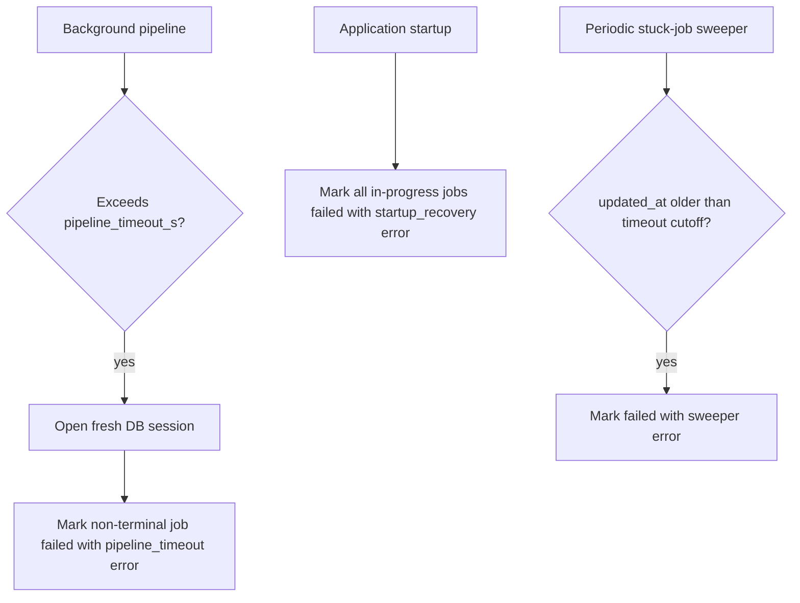

## 10. Failure and Partial-Success Semantics

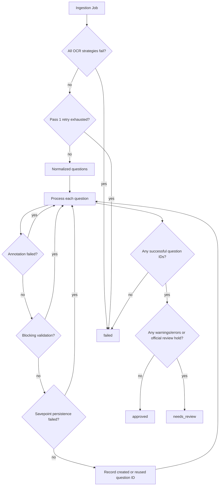

### Blocking Versus Non-Blocking Behavior

| Event | Blocking? | Persisted result |
|---|---|---|
| No OCR provider or all OCR fallbacks fail | Yes, entire job | Job becomes `failed`; OCR error stored. |
| No usable raw text | Yes, entire job | Job becomes `failed`. |
| Pass 1 retry exhaustion | Yes, entire job | Job becomes `failed`; extraction error stored. |
| Normalization drop | No for sibling questions | Issue is stored; surviving questions continue. |
| Official number, OCR cross-check, or module-completeness warning | No for persistence, yes for activation | Questions continue as drafts; job becomes `needs_review`. |
| Layout detection or diagnostics write failure | No | Logged; pipeline continues. |
| One annotation failure | No for sibling questions | Issue stored; failed question skipped. |
| One blocking validation result | No for sibling questions | Issue stored; failed question skipped. |
| One savepoint persistence failure | No for sibling questions | Issue stored; successful siblings remain. |
| YAML export failure | No | Logged only; DB persistence remains authoritative. |
| Pipeline timeout | Yes | Fresh session marks non-terminal job `failed`. |

## 11. Reannotation Flow

Reannotation is a separate pipeline. It does not call `_run_pipeline()`.

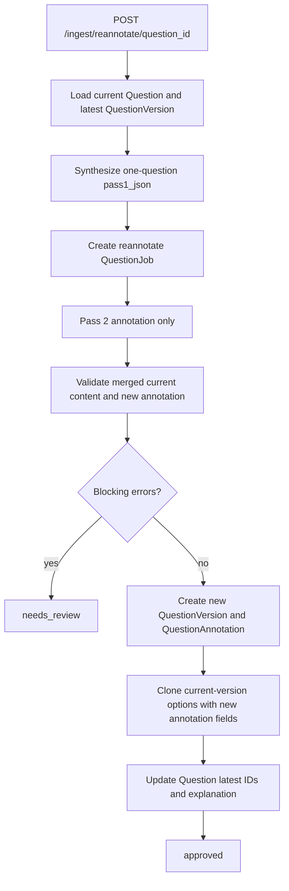

## 12. OCR Benchmark Flow

The OCR benchmark endpoint uses the production ingestion pipeline rather than a
separate benchmark-only extractor.

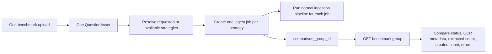

## 13. Known Current Inconsistencies

These are current-code facts, not target architecture:

1. `backend/app/routers/ingest.py` owns intake, OCR, coordination, enrichment,
   persistence, and finalization in one large module.
2. `JobOrchestrator` defines a transition interface, but direct persisted status
   assignments bypass it in much of the pipeline.
3. `pass1_json` and `pass2_json` are untyped internal protocols with private
   underscore-prefixed keys and the `_vision_fused_` sentinel.
4. `ingest_unofficial_batch()` calls the single-file HTTP route function directly.
5. File intake stores only a 100,000-character raw-text preview in the seeded
   job envelope.
6. External enrichment and export work is interleaved with persistence processing.
7. Layout detection is broad and non-blocking; missing layout output can leave
   visual stimuli without crops.
8. Background tasks are in-process. Startup recovery marks interrupted jobs
   failed rather than resuming them.

Track proposed fixes outside this document. Remove an inconsistency from this
list only after the code changes.

## 14. Architecture Update Checklist

When ingestion architecture changes, update:

- [ ] public entry-point diagram and contract table;
- [ ] seeded `pass1_json` contract;
- [ ] OCR/source-acquisition decision diagram and fallback order;
- [ ] complete pipeline sequence and stage ordering;
- [ ] concurrency statements for annotation and OCR;
- [ ] per-question processing and transaction semantics;
- [ ] database entity and object-artifact diagrams;
- [ ] status, recovery, timeout, and terminal rules;
- [ ] blocking/non-blocking failure table;
- [ ] known current inconsistencies;
- [ ] verified date and commit/worktree note.

Then run:

```bash
git diff --check -- docs/backend/INGESTION_ARCHITECTURE.md
cd backend
uv run pytest tests/test_ingest_router.py tests/test_pipeline.py tests/test_backend_regressions.py -q
```
