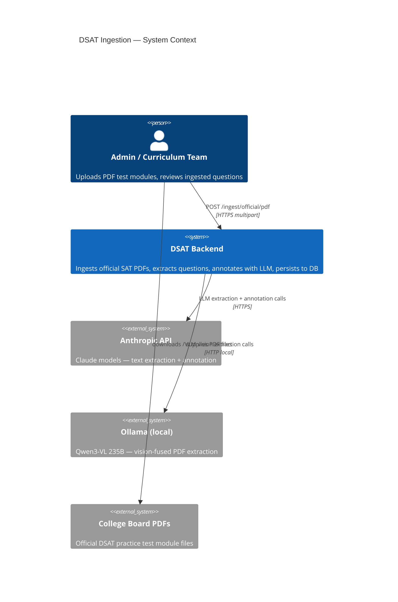
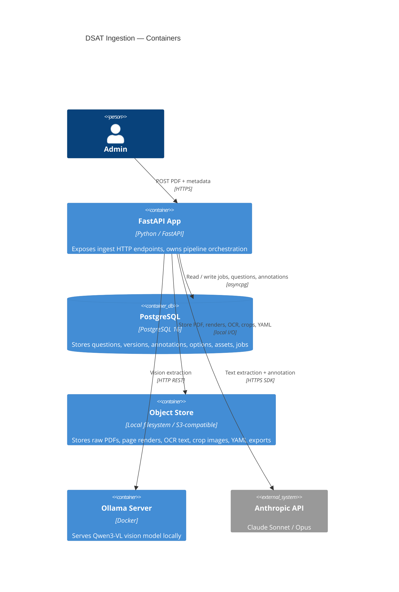
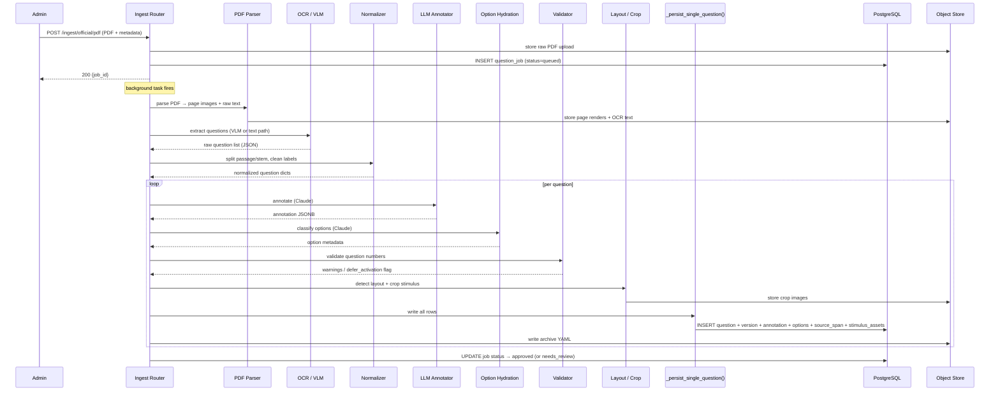

# C4 Diagram — DSAT Ingestion Pipeline

---

## Level 1 — System Context

---

## Level 2 — Containers

---

## Level 3 — Components (FastAPI App)

```mermaid
C4Component
  title DSAT Ingestion — Components inside FastAPI App

  Person(admin, "Admin")

  Component(ingest_router, "Ingest Router", "app/routers/ingest.py", "HTTP endpoints: /official/pdf, /unofficial/file, /text, /reannotate, /benchmark/ocr, /gc/images")
  Component(orchestrator, "Job Orchestrator", "app/pipeline/orchestrator.py", "Tracks QuestionJob status transitions (queued → processing → approved / needs_review / failed)")
  Component(pdf_parser, "PDF Parser", "app/parsers/pdf_parser.py", "PyMuPDF — renders pages to images, extracts raw text per page")
  Component(ocr, "OCR Module", "app/parsers/ocr.py", "Drives VLM or text-extraction path; returns structured question list")
  Component(normalizer, "Extractor / Normalizer", "ingest.py internal", "_normalize_extracted_questions() — splits passage from stem, recovers dropped passages, cleans option labels")
  Component(annotator, "LLM Annotator", "app/prompts/annotate_prompt.py", "Sends each question to Claude for grammar/reading annotation JSONB")
  Component(validator, "Validator", "app/pipeline/validator.py", "Cross-checks question numbers vs OCR scan; sets defer_activation flag")
  Component(option_hydration, "Option Hydration", "app/pipeline/option_hydration.py", "Calls LLM to classify each distractor — role, type, failure mode")
  Component(persist, "Persister", "_persist_single_question()", "Writes Question + Version + Annotation + Options + SourceSpan + StimulusAssets to DB in one transaction")
  Component(crop_detector, "Layout / Crop", "app/storage/crop_detector.py", "GLM layout detection → crop stimulus images from page renders")
  Component(object_store, "Object Store Client", "app/storage/object_store.py + local_store.py", "put_object / read_object abstraction over local FS or S3")
  Component(yaml_export, "YAML Exporter", "app/storage/yaml_export.py", "Writes archive YAML snapshot per question")

  ContainerDb(pg, "PostgreSQL")
  Container(objstore, "Object Store")
  System_Ext(anthropic, "Anthropic API")
  System_Ext(ollama_c, "Ollama Server")

  Rel(admin, ingest_router, "POST /ingest/official/pdf")
  Rel(ingest_router, orchestrator, "create + advance job status")
  Rel(ingest_router, pdf_parser, "parse PDF → page images + raw text")
  Rel(ingest_router, ocr, "extract questions from pages")
  Rel(ocr, ollama_c, "vision-fused extraction (Qwen3-VL)")
  Rel(ocr, anthropic, "text-extraction path (Claude)")
  Rel(ingest_router, normalizer, "clean + split extracted output")
  Rel(ingest_router, annotator, "annotate each question")
  Rel(annotator, anthropic, "annotation call (Claude)")
  Rel(ingest_router, validator, "validate question numbers vs OCR")
  Rel(ingest_router, option_hydration, "classify distractors per option")
  Rel(option_hydration, anthropic, "option analysis call (Claude)")
  Rel(ingest_router, crop_detector, "detect layout + crop stimulus regions")
  Rel(ingest_router, persist, "write all DB rows atomically")
  Rel(persist, pg, "INSERT questions, versions, annotations, options, assets")
  Rel(ingest_router, object_store, "store PDF, renders, OCR text, crops")
  Rel(object_store, objstore, "file I/O")
  Rel(ingest_router, yaml_export, "write archive YAML")
  Rel(yaml_export, objstore, "write .yaml file")
  Rel(orchestrator, pg, "UPDATE question_jobs.status")
```

---

## Level 4 — Key Code Sequence: `_run_pipeline()` (happy path)

